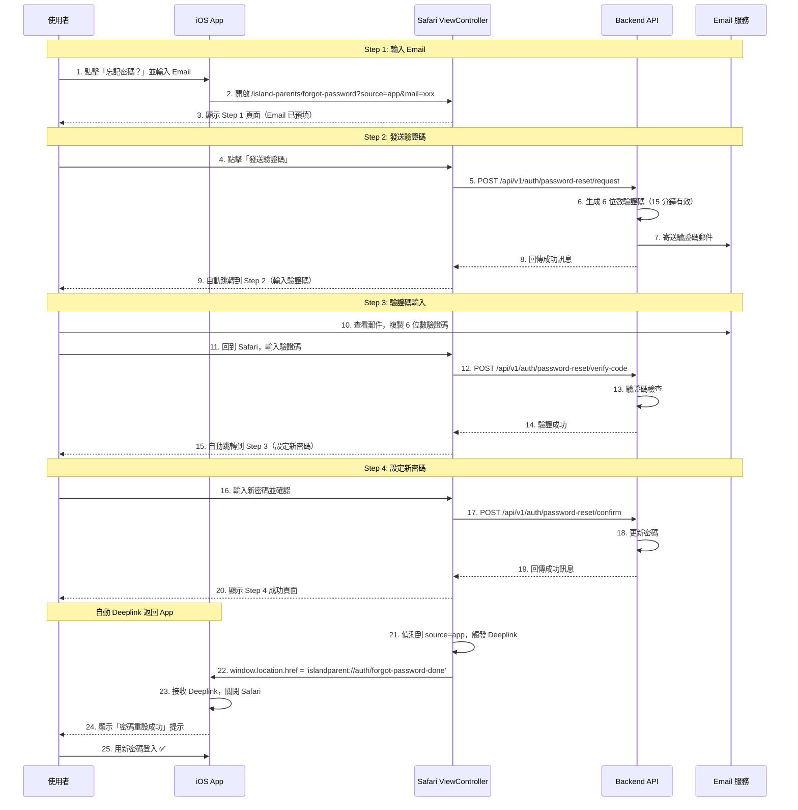

# Island Parents iOS App 開發指南

> **版本**: v1.11
> **適用對象**: iOS 開發者
> **後端版本**: career_ios_backend
> **最後更新**: 2026-01-27

---

## 1. 系統概述

### 1.1 產品定位
Island Parents 是一款 **AI 親子教養助手**，幫助家長在與孩子互動時獲得即時指導。

### 1.2 核心功能
| 功能 | 說明 | API |
|------|------|-----|
| 即時轉錄 | 語音轉文字 (Scribe v2) | ElevenLabs SDK |
| 快速回饋 | 15 秒一次的鼓勵訊息 | `POST /sessions/{id}/quick-feedback` |
| 深度分析 | 紅黃綠燈安全評估 | `POST /sessions/{id}/deep-analyze` |
| 諮詢報告 | 完整對話分析報告 | `POST /sessions/{id}/report` |

### 1.3 技術架構
```
┌─────────────────────────────────────────────┐
│                   iOS App                    │
├─────────────────────────────────────────────┤
│ ElevenLabs SDK        │ Backend API Client  │
│ (Scribe v2 Realtime)  │ (REST + JSON)       │
└──────────┬────────────┴──────────┬──────────┘
           │                       │
           ▼                       ▼
┌──────────────────┐    ┌─────────────────────┐
│ ElevenLabs Cloud │    │ career_ios_backend  │
│ STT: 150ms 延遲  │    │ FastAPI + Gemini    │
└──────────────────┘    └─────────────────────┘
```

---

## 1.5. App 配置 API (動態 URL 管理)

### 1.5.1 取得 App 配置

**端點:** `GET /api/v1/app/config/island_parents`

**認證:** 🔓 無需認證（公開端點）

**用途:** App 啟動時獲取最新的 URLs，無需硬編碼

### Request

```http
GET /api/v1/app/config/island_parents
```

### Response 200 OK

```json
{
  "terms_url": "https://www.comma.study/island_parents_terms_of_service/",
  "privacy_url": "https://www.comma.study/island_parents_privacy_policy/",
  "landing_page_url": "https://www.comma.study/island_parents_landing/",
  "help_url": "https://duodian.com/career/help",
  "forgot_password_url": "https://duodian.com/career/forgot-password",
  "base_url": "https://career-app-api-staging-xxxx.run.app",
  "version": "1.0.0",
  "maintenance_mode": false
}
```

### 欄位說明

| 欄位 | 說明 | 使用時機 |
|------|------|---------|
| `terms_url` | 服務條款頁面 | 顯示在 WebView |
| `privacy_url` | 隱私權政策頁面 | 顯示在 WebView |
| `landing_page_url` | Landing Page | 官網導向 |
| `help_url` | 幫助頁面 | 顯示在 WebView |
| `forgot_password_url` | 忘記密碼頁面 | 顯示在 WebView |
| `base_url` | API Base URL | API 請求根路徑 |
| `version` | 配置版本號 | 版本檢查 |
| `maintenance_mode` | 維護模式開關 | 顯示維護畫面 |

### Swift 實作範例

```swift
struct AppConfig: Codable {
    let termsUrl: String
    let privacyUrl: String
    let landingPageUrl: String
    let helpUrl: String
    let forgotPasswordUrl: String
    let baseUrl: String
    let version: String
    let maintenanceMode: Bool

    enum CodingKeys: String, CodingKey {
        case termsUrl = "terms_url"
        case privacyUrl = "privacy_url"
        case landingPageUrl = "landing_page_url"
        case helpUrl = "help_url"
        case forgotPasswordUrl = "forgot_password_url"
        case baseUrl = "base_url"
        case version, maintenanceMode = "maintenance_mode"
    }
}

// App 啟動時呼叫
func fetchAppConfig() async throws -> AppConfig {
    let url = URL(string: "https://your-api.com/api/v1/app/config/island_parents")!
    let (data, _) = try await URLSession.shared.data(from: url)
    return try JSONDecoder().decode(AppConfig.self, from: data)
}

// 儲存在本地
UserDefaults.standard.set(config.termsUrl, forKey: "termsUrl")
UserDefaults.standard.set(config.privacyUrl, forKey: "privacyUrl")
```

### 使用時機

1. **App 啟動時** - 獲取最新配置並儲存
2. **法律頁面** - 使用 `terms_url`/`privacy_url` 顯示在 WebView
3. **維護模式** - 檢查 `maintenance_mode` 決定是否顯示維護畫面
4. **版本檢查** - 比對 `version` 判斷是否需要更新配置

### 優點

- ✅ **無需發版更新** - URL 變更只需修改後端配置
- ✅ **支援 A/B Testing** - 可測試不同 URL
- ✅ **快速維護切換** - 緊急維護時可即時開啟

---

## 2. 認證系統

### 2.1 註冊 (Register)

**⚠️ 最新版本：已簡化為只需 Email + Password**

```http
POST /api/auth/register
Content-Type: application/json

{
  "email": "user@example.com",
  "password": "password123",
  "tenant_id": "island_parents"
}
```

**必填欄位**：
- `email`: 使用者 Email（唯一識別）
- `password`: 密碼（最少 8 個字元）
- `tenant_id`: **固定值** `"island_parents"`（浮島親子專用）

**選填欄位**（已移除，不需要傳）：
- ~~`username`~~ - 後端會自動生成
- ~~`full_name`~~ - 可稍後更新
- ~~`phone`~~ - 可稍後更新

**Response (201):**
```json
{
  "access_token": "eyJhbGciOiJIUzI1NiIsInR5cCI6IkpXVCJ9...",
  "token_type": "bearer",
  "expires_in": 7776000
}
```

**iOS 實作建議**：
```swift
struct RegisterRequest: Codable {
    let email: String
    let password: String
    let tenantId: String = "island_parents"  // 固定值

    enum CodingKeys: String, CodingKey {
        case email, password
        case tenantId = "tenant_id"
    }
}
```

**註冊成功後自動登入**：無需再次呼叫 login API，直接使用回傳的 `access_token`。

---

### 2.2 登入 (Login)

```http
POST /api/auth/login
Content-Type: application/json

{
  "email": "user@example.com",
  "password": "password123",
  "tenant_id": "island_parents"
}
```

**⚠️ 注意**：
- 使用 `email` 而非 `username`
- 必須傳入 `tenant_id: "island_parents"`

**Response (200):**
```json
{
  "access_token": "eyJhbGciOiJIUzI1NiIsInR5cCI6IkpXVCJ9...",
  "token_type": "bearer",
  "expires_in": 7776000
}
```

**iOS 實作建議**：
```swift
struct LoginRequest: Codable {
    let email: String
    let password: String
    let tenantId: String = "island_parents"  // 固定值

    enum CodingKeys: String, CodingKey {
        case email, password
        case tenantId = "tenant_id"
    }
}
```

---

### 2.3 忘記密碼（4 步驟驗證碼流程）

**⚠️ iOS 開發重點：使用 SFSafariViewController 開啟 Web 頁面處理，成功後自動 Deeplink 返回 App**

#### 2.3.1 忘記密碼頁面 URL

**Staging 環境**：
```
https://career-app-api-staging-978304030758.us-central1.run.app/island-parents/forgot-password?source=app&mail={user_email}
```

**Production 環境**：
```
https://[production-url]/island-parents/forgot-password?source=app&mail={user_email}
```

**URL 參數說明**：
- `source=app` - 必須，觸發自動 Deeplink 返回 App
- `mail={email}` - 選填，預填使用者 Email

**iOS 實作**：
```swift
import SafariServices

class LoginViewController: UIViewController {

    @IBAction func forgotPasswordTapped(_ sender: UIButton) {
        guard let email = emailTextField.text, !email.isEmpty else {
            showError("請輸入 Email")
            return
        }
        openForgotPasswordPage(email: email)
    }

    func openForgotPasswordPage(email: String) {
        let baseURL = "https://career-app-api-staging-978304030758.us-central1.run.app"
        let encodedEmail = email.addingPercentEncoding(withAllowedCharacters: .urlQueryAllowed) ?? ""
        let urlString = "\(baseURL)/island-parents/forgot-password?source=app&mail=\(encodedEmail)"

        guard let url = URL(string: urlString) else {
            print("Invalid URL")
            return
        }

        let safariVC = SFSafariViewController(url: url)
        safariVC.preferredControlTintColor = .systemBlue
        safariVC.dismissButtonStyle = .close

        present(safariVC, animated: true)
    }
}
```

#### 2.3.2 完整 4 步驟驗證碼流程（給 PM 參考）



#### 2.3.3 4 步驟流程說明

**新版密碼重設流程使用驗證碼而非 Token，提供更安全且即時的體驗：**

**Step 1: 輸入 Email**
- 使用者在 App 點擊「忘記密碼」
- App 開啟 SFSafariViewController，URL 包含 `?source=app&mail={email}`
- Web 頁面顯示 Email 輸入框（已預填）
- 使用者點擊「發送驗證碼」

**Step 2: 輸入驗證碼**
- Backend 生成 6 位數驗證碼（15 分鐘有效）
- 驗證碼郵件發送到使用者信箱
- 頁面自動跳轉到驗證碼輸入頁
- 使用者查看郵件，複製驗證碼
- 使用者回到 Safari，輸入驗證碼
- 點擊「驗證」

**Step 3: 設定新密碼**
- 驗證成功後自動跳轉到密碼設定頁
- 使用者輸入新密碼並確認
- 點擊「確認重設密碼」

**Step 4: 成功頁面與自動 Deeplink**
- 密碼重設成功，顯示成功頁面
- **自動觸發 Deeplink**：`islandparent://auth/forgot-password-done`
- Safari 自動關閉，返回 App
- App 顯示成功提示
- 使用者可立即使用新密碼登入

**Fallback 機制**：
- 如果 3 秒內 App 未接收 Deeplink（如 App 被關閉）
- 頁面自動跳轉到網頁登入頁面 `/island-parents`

#### 2.3.4 iOS Deeplink 整合

**1. 註冊 URL Scheme (Info.plist)**

```xml
<key>CFBundleURLTypes</key>
<array>
    <dict>
        <key>CFBundleURLSchemes</key>
        <array>
            <string>islandparent</string>
        </array>
        <key>CFBundleURLName</key>
        <string>com.yourcompany.islandparents</string>
    </dict>
</array>
```

**2. 處理 Deeplink (AppDelegate/SceneDelegate)**

```swift
// AppDelegate.swift
func application(_ app: UIApplication,
                open url: URL,
                options: [UIApplication.OpenURLOptionsKey : Any] = [:]) -> Bool {

    guard url.scheme == "islandparent",
          url.host == "auth" else {
        return false
    }

    // 處理忘記密碼完成 Deeplink
    if url.path == "/forgot-password-done" {
        // 關閉 SFSafariViewController
        if let presented = UIApplication.shared.windows.first?.rootViewController?.presentedViewController {
            presented.dismiss(animated: true) {
                // 顯示成功訊息
                self.showPasswordResetSuccess()
            }
        }
        return true
    }

    return false
}

func showPasswordResetSuccess() {
    DispatchQueue.main.async {
        let alert = UIAlertController(
            title: "密碼重設成功",
            message: "請使用新密碼登入",
            preferredStyle: .alert
        )
        alert.addAction(UIAlertAction(title: "確定", style: .default))

        UIApplication.shared.windows.first?.rootViewController?
            .present(alert, animated: true)
    }
}
```

**3. 完整流程範例**

```swift
class ForgotPasswordViewController: UIViewController {

    @IBOutlet weak var emailTextField: UITextField!

    @IBAction func resetPasswordTapped(_ sender: UIButton) {
        guard let email = emailTextField.text, !email.isEmpty else {
            showError("請輸入 Email")
            return
        }

        // 開啟 Safari ViewController
        openForgotPasswordPage(email: email)
    }

    func openForgotPasswordPage(email: String) {
        let baseURL = "https://career-app-api-staging-978304030758.us-central1.run.app"
        let encodedEmail = email.addingPercentEncoding(withAllowedCharacters: .urlQueryAllowed) ?? ""

        // 重要：必須包含 source=app 參數才會觸發 Deeplink
        let urlString = "\(baseURL)/island-parents/forgot-password?source=app&mail=\(encodedEmail)"

        guard let url = URL(string: urlString) else {
            showError("無效的 URL")
            return
        }

        let safariVC = SFSafariViewController(url: url)
        safariVC.preferredControlTintColor = .systemBlue
        safariVC.dismissButtonStyle = .close

        present(safariVC, animated: true)
    }

    func showError(_ message: String) {
        let alert = UIAlertController(
            title: "錯誤",
            message: message,
            preferredStyle: .alert
        )
        alert.addAction(UIAlertAction(title: "確定", style: .default))
        present(alert, animated: true)
    }
}
```

#### 2.3.5 新舊版本差異

| 項目 | 舊版（Token-based） | 新版（Verification Code） |
|------|------------------|-------------------------|
| **重設方式** | 郵件連結 + Token | 6 位數驗證碼 |
| **有效期限** | 6 小時 | 15 分鐘 |
| **使用者體驗** | 需要點擊郵件連結 | 複製驗證碼即可 |
| **安全性** | Token 在 URL 中 | 驗證碼不在 URL |
| **自動返回** | 手動點擊按鈕 | 自動 Deeplink |
| **步驟數** | 2 個頁面 | 4 個步驟（單頁） |

**新版優勢**：
- ✅ **更安全**：驗證碼不會出現在 URL 或瀏覽器歷史記錄
- ✅ **更快速**：15 分鐘內完成，減少等待時間
- ✅ **更流暢**：自動 Deeplink 返回 App，無需手動操作
- ✅ **更直觀**：4 步驟進度條，清楚知道目前進度

#### 2.3.6 測試方式

**手動測試**：
1. 在 iOS 模擬器或實機開啟 App
2. 點擊「忘記密碼」，輸入 Email
3. Safari 開啟，確認 URL 包含 `?source=app&mail=xxx`
4. 點擊「發送驗證碼」
5. 檢查信箱收到 6 位數驗證碼郵件
6. 在 Safari 輸入驗證碼，點擊「驗證」
7. 輸入新密碼並確認
8. 點擊「確認重設密碼」
9. ✅ Safari 應自動關閉並返回 App
10. ✅ App 顯示「密碼重設成功」提示
11. 使用新密碼登入

**Fallback 測試**：
1. 在 Safari 瀏覽器（非 App）打開：`https://career-app-api-staging-978304030758.us-central1.run.app/island-parents/forgot-password?source=app&mail=test@example.com`
2. 完成 4 步驟流程
3. ✅ 3 秒後應顯示「App 未開啟，返回登入頁面...」
4. ✅ 自動跳轉到網頁登入頁面

---

### 2.4 Token 使用
所有需認證的 API 都需要在 Header 加上：
```
Authorization: Bearer <access_token>
```

### 2.5 Token 有效期
- **有效期**: 90 天 (7776000 秒)
- **建議**: 儲存於 Keychain，到期前自動更新

---

## 2.6 Client & Case 管理 (Island Parents)

### 2.6.1 創建孩子與案例

**用途**: 在開始錄音前，必須先建立孩子（Client）與案例（Case）

**Staging URL**:
```
POST https://career-app-api-staging-978304030758.us-central1.run.app/api/v1/ui/client-case
Authorization: Bearer <token>
Content-Type: application/json
```

**Request Body**:
```json
{
  "name": "小明",           // 孩子名稱 (必填)
  "grade": "小五",          // 年級 (必填)
  "relationship": "媽媽"    // 與孩子的關係 (必填)
}
```

**必填欄位說明**:
- `name` (string): 孩子名稱
- `grade` (string): 年級（例如："小一"、"小五"、"國二"）
- `relationship` (string): 與孩子的關係（例如："媽媽"、"爸爸"、"阿嬤"）

**選填欄位**（親子版不需要）:
- `email` - 孩子 Email（選填，可留空）
- `phone` - 孩子手機（選填）
- 其他欄位（gender, birth_date 等）會自動填入預設值

**Response (201)**:
```json
{
  "client_id": "fb719809-6775-41ca-99c4-abc42c9f7c86",
  "client_code": "C0033",
  "client_name": "小明",
  "client_email": null,
  "case_id": "52115919-eeec-4660-80c6-64c6f2581539",
  "case_number": "CASE0041",
  "case_status": 0,
  "created_at": "2026-01-25T15:18:25.912110Z",
  "message": "客戶與個案建立成功"
}
```

**Response 欄位說明**:
- `client_id`: 孩子的唯一識別碼（UUID），供參考使用
- `client_code`: 孩子的編號（系統自動生成）
- `client_name`: 孩子名稱
- `client_email`: Email（親子版通常為 null）
- `case_id`: 案例的唯一識別碼（UUID），**建立 Session 時使用此 ID**
- `case_number`: 案例編號（系統自動生成）
- `case_status`: 案例狀態（0=未開始, 1=進行中, 2=已完成）
- `created_at`: 建立時間
- `message`: 成功訊息

**iOS 實作建議**:
```swift
struct ClientCaseCreateRequest: Codable {
    let name: String
    let grade: String
    let relationship: String
}

struct ClientCaseCreateResponse: Codable {
    let clientId: String
    let clientCode: String
    let clientName: String
    let clientEmail: String?
    let caseId: String
    let caseNumber: String
    let caseStatus: Int
    let createdAt: String
    let message: String

    enum CodingKeys: String, CodingKey {
        case clientId = "client_id"
        case clientCode = "client_code"
        case clientName = "client_name"
        case clientEmail = "client_email"
        case caseId = "case_id"
        case caseNumber = "case_number"
        case caseStatus = "case_status"
        case createdAt = "created_at"
        case message
    }
}

func createClientCase(
    name: String,
    grade: String,
    relationship: String
) async throws -> ClientCaseCreateResponse {
    let baseURL = URL(string: "https://career-app-api-staging-978304030758.us-central1.run.app")!
    let url = baseURL.appendingPathComponent("api/v1/ui/client-case")

    var request = URLRequest(url: url)
    request.httpMethod = "POST"
    request.setValue("Bearer \(token)", forHTTPHeaderField: "Authorization")
    request.setValue("application/json", forHTTPHeaderField: "Content-Type")

    let body = ClientCaseCreateRequest(
        name: name,
        grade: grade,
        relationship: relationship
    )
    request.httpBody = try JSONEncoder().encode(body)

    let (data, response) = try await URLSession.shared.data(for: request)

    guard let httpResponse = response as? HTTPURLResponse,
          httpResponse.statusCode == 201 else {
        throw APIError.invalidResponse
    }

    return try JSONDecoder().decode(
        ClientCaseCreateResponse.self,
        from: data
    )
}
```

**使用流程**:
1. 使用者首次開啟 App 或新增孩子時
2. 填寫孩子名稱、年級、與孩子的關係
3. 呼叫此 API 創建 client 和 case
4. 儲存回傳的 `case_id`（建立 Session 時需要）
5. 建立 Session 時使用 `case_id`（參見 Section 3.2）

**錯誤處理**:
```json
// 400 Bad Request - 缺少必填欄位
{
  "detail": "缺少必填欄位：年級, 與孩子的關係"
}
```

```json
// 500 Internal Server Error - 伺服器錯誤
{
  "type": "https://api.career-counseling.app/errors/internal-server-error",
  "title": "Internal Server Error",
  "status": 500,
  "detail": "Failed to create client and case: ...",
  "instance": "/api/v1/ui/client-case"
}
```

**Swift 錯誤處理範例**:
```swift
do {
    let response = try await createClientCase(
        name: "小明",
        grade: "小五",
        relationship: "媽媽"
    )

    // 儲存到 UserDefaults 或資料庫
    UserDefaults.standard.set(response.clientId, forKey: "currentClientId")
    UserDefaults.standard.set(response.caseId, forKey: "currentCaseId")

    print("孩子建立成功：\(response.clientName)")

} catch let error as APIError {
    switch error {
    case .badRequest(let message):
        // 顯示錯誤訊息給使用者
        showAlert(title: "建立失敗", message: message)
    case .serverError:
        showAlert(title: "伺服器錯誤", message: "請稍後再試")
    default:
        showAlert(title: "錯誤", message: "無法建立孩子資料")
    }
}
```

### 2.6.2 列出所有孩子

**用途**: 首頁顯示所有孩子列表、切換不同孩子的對話歷史

**Staging URL**:
```
GET https://career-app-api-staging-978304030758.us-central1.run.app/api/v1/ui/client-case-list?skip=0&limit=20
Authorization: Bearer <token>
```

**Query Parameters**:
- `skip` (int, optional): 分頁偏移，預設 0
- `limit` (int, optional): 每頁筆數，預設 100，最大 500

**Response (200)**:
```json
{
  "total": 2,
  "skip": 0,
  "limit": 20,
  "items": [
    {
      "client_id": "fb719809-6775-41ca-99c4-abc42c9f7c86",
      "case_id": "52115919-eeec-4660-80c6-64c6f2581539",
      "counselor_id": "abc-123-def-456",
      "client_name": "小明",
      "client_code": "C0033",
      "client_email": null,
      "identity_option": "其他",
      "current_status": "親子對話",
      "case_number": "CASE0041",
      "case_status": 0,
      "case_status_label": "未開始",
      "last_session_date": "2026-01-25T10:00:00Z",
      "last_session_date_display": "2026-01-25 10:00",
      "total_sessions": 3,
      "case_created_at": "2026-01-25T15:18:25.912110Z",
      "case_updated_at": "2026-01-25T16:30:00Z"
    },
    {
      "client_id": "abc-234-xyz-789",
      "case_id": "def-567-uvw-890",
      "counselor_id": "abc-123-def-456",
      "client_name": "小華",
      "client_code": "C0034",
      "client_email": null,
      "identity_option": "其他",
      "current_status": "親子對話",
      "case_number": "CASE0042",
      "case_status": 1,
      "case_status_label": "進行中",
      "last_session_date": null,
      "last_session_date_display": null,
      "total_sessions": 0,
      "case_created_at": "2026-01-24T10:00:00Z",
      "case_updated_at": null
    }
  ]
}
```

**iOS 實作建議**:
```swift
struct ClientCaseListItem: Codable {
    let clientId: String
    let caseId: String
    let clientName: String
    let clientCode: String
    let caseNumber: String
    let caseStatus: Int
    let caseStatusLabel: String
    let totalSessions: Int
    let lastSessionDate: String?
    let caseCreatedAt: String

    enum CodingKeys: String, CodingKey {
        case clientId = "client_id"
        case caseId = "case_id"
        case clientName = "client_name"
        case clientCode = "client_code"
        case caseNumber = "case_number"
        case caseStatus = "case_status"
        case caseStatusLabel = "case_status_label"
        case totalSessions = "total_sessions"
        case lastSessionDate = "last_session_date"
        case caseCreatedAt = "case_created_at"
    }
}

struct ClientCaseListResponse: Codable {
    let total: Int
    let skip: Int
    let limit: Int
    let items: [ClientCaseListItem]
}

func listClientCases(skip: Int = 0, limit: Int = 20) async throws -> ClientCaseListResponse {
    let baseURL = URL(string: "https://career-app-api-staging-978304030758.us-central1.run.app")!
    var components = URLComponents(url: baseURL.appendingPathComponent("api/v1/ui/client-case-list"), resolvingAgainstBaseURL: true)!
    components.queryItems = [
        URLQueryItem(name: "skip", value: "\(skip)"),
        URLQueryItem(name: "limit", value: "\(limit)")
    ]

    var request = URLRequest(url: components.url!)
    request.httpMethod = "GET"
    request.setValue("Bearer \(token)", forHTTPHeaderField: "Authorization")

    let (data, response) = try await URLSession.shared.data(for: request)

    guard let httpResponse = response as? HTTPURLResponse,
          httpResponse.statusCode == 200 else {
        throw APIError.invalidResponse
    }

    return try JSONDecoder().decode(ClientCaseListResponse.self, from: data)
}
```

**UI 使用場景**:
- **首頁孩子列表**: 顯示所有孩子，點擊進入該孩子的對話歷史
- **切換孩子**: 使用 Picker 或 Modal 讓家長選擇不同孩子
- **孩子卡片**: 顯示孩子名稱、總會談次數、最後會談時間

---

## 3. Session Workflow

### 3.1 完整流程
```
1. 創建孩子與案例 (POST /api/v1/ui/client-case) ← 首次使用必須
   ↓ 取得 case_id
2. 選擇情境 (scenario)
   ↓
3. 建立 Session (POST /api/v1/sessions) ← 使用 case_id
   ↓
4. 取得會談 (GET /api/v1/sessions/{id}) ← 確認 Session 資料
   ↓
5. 開始錄音 (ElevenLabs Scribe v2)
   ↓
6. 即時上傳逐字稿 (append)
   ↓
7. 觸發分析 (Quick / Deep)
   ↓
8. 結束錄音
   ↓
9. 生成報告 (Report)
```

### 3.2 建立 Session

> ⚠️ **前置需求**: 必須先完成 Section 2.6.1 創建孩子與案例，取得 `case_id`

```
POST /api/v1/sessions
Authorization: Bearer <token>
Content-Type: application/json

{
  "case_id": "uuid-of-case",          // 從 2.6.1 創建孩子時取得 (必填)
  "session_mode": "practice",         // 選填
  "scenario": "homework",             // 選填
  "scenario_description": "孩子回家後不願意寫功課，一直玩手機"  // 選填
}
```

**session_mode 選項:**
| session_mode | 說明 | 適用場景 |
|--------------|------|----------|
| `practice` | 練習模式 | 家長獨自練習，沒有孩子在場 |
| `emergency` | 對談模式 | 真實親子互動現場 |

**Response (201):**
```json
{
  "id": "session-uuid",
  "client_id": "client-uuid",
  "case_id": "case-uuid",
  "session_mode": "practice",
  "scenario": "homework",
  "scenario_description": "孩子回家後不願意寫功課，一直玩手機",
  "status": "active",
  "created_at": "2025-01-05T10:00:00Z"
}
```

### 3.3 取得會談 (Get Session)
建立 Session 後，可透過此 API 取得完整 Session 資料。

```
GET /api/v1/sessions/{session_id}
Authorization: Bearer <token>
```

**Response (200):**
```json
{
  "id": "session-uuid",
  "client_id": "client-uuid",
  "client_name": "小明",
  "client_code": "CHILD001",
  "case_id": "case-uuid",
  "session_number": 5,
  "session_date": "2025-01-05T10:00:00Z",
  "name": "諮詢 - 2025-01-05 10:00",
  "start_time": "2025-01-05T10:00:00Z",
  "end_time": null,
  "transcript_text": "",
  "summary": null,
  "duration_minutes": null,
  "notes": null,
  "reflection": {},
  "recordings": [],
  "session_mode": "practice",
  "scenario": "homework",
  "scenario_description": "孩子回家後不願意寫功課，一直玩手機",
  "has_report": false,
  "created_at": "2025-01-05T10:00:00Z",
  "updated_at": "2025-01-05T10:00:00Z"
}
```

**用途:**
- 錄音頁面載入時確認 Session 狀態
- 確認 scenario 設定是否正確
- 查看累積的 transcript_text

### 3.4 上傳逐字稿片段
```
POST /api/v1/sessions/{session_id}/recordings/append
Authorization: Bearer <token>
Content-Type: application/json

{
  "transcript_segment": "媽媽：寶貝，功課寫完了嗎？\n孩子：還沒，我想先玩一下。",
  "start_time": "2025-01-05T10:00:00.000Z",
  "end_time": "2025-01-05T10:00:15.000Z"
}
```

**注意**: `start_time` 和 `end_time` 必須是 **ISO 8601 格式的字串**（非數字），例如 `new Date().toISOString()`。

**Response (200):**
```json
{
  "success": true,
  "session_id": "session-uuid",
  "total_duration_seconds": 15.0,
  "transcript_length": 45
}
```

**上傳頻率建議:**
- 每 **10-15 秒** 上傳一次
- 配合 ElevenLabs Scribe v2 的 chunk 輸出

---

## 4. AI 分析 APIs

### 4.1 Quick Feedback (快速回饋)
**用途**: 每 15 秒提供即時鼓勵訊息

> ⚠️ **字數限制**: `message` 欄位強制 **15 字以內**，適合同心圓 UI 顯示

```
POST /api/v1/sessions/{session_id}/quick-feedback?session_mode=practice
Authorization: Bearer <token>
```

**注意**: 此 API 不需要 request body，會自動從 session 讀取最近 15 秒的逐字稿。

**Query Parameters:**
- `session_mode`: `practice` (練習模式，預設) 或 `emergency` (對談模式)

**Response (200):**
```json
{
  "message": "你沒急著反駁",
  "type": "ai_generated",
  "timestamp": "2025-01-05T10:00:15Z",
  "latency_ms": 850
}
```

**觸發時機:**
- 每 15 秒自動觸發
- Buffer 有新內容時才觸發
- 避免重複分析相同內容

### 4.2 Deep Analyze (深度分析)
**用途**: 紅黃綠燈評估 + 專家建議

```
POST /api/v1/sessions/{session_id}/deep-analyze
Authorization: Bearer <token>
Content-Type: application/json
```

**注意**: 此 API 不需要 request body，會自動使用 session 中累積的逐字稿。

**Response (200):**
```json
{
  "safety_level": "yellow",
  "summary": "家長嘗試與孩子溝通功課問題，但孩子有些抗拒",
  "alerts": [
    "⚠️ 孩子顯示抗拒情緒",
    "⚠️ 注意溝通方式是否給孩子壓力"
  ],
  "suggestions": [
    "可以先問「今天在學校有什麼好玩的事嗎？」",
    "建立連結後再談功課"
  ],
  "time_range": "0:00-2:00",
  "timestamp": "2026-01-07T10:00:00+00:00",
  "rag_sources": [
    {
      "title": "正向教養：同理心優先",
      "content": "先同理孩子的感受，再引導行為...",
      "score": 0.85,
      "theory": "正向教養"
    }
  ],
  "cache_metadata": null,
  "provider_metadata": {
    "provider": "gemini",
    "latency_ms": 1200,
    "model": "gemini-3-flash-preview"
  }
}
```

**⚠️ 重要：`suggestions` 和 `alerts` 都是字串陣列 `List[str]`，不是物件陣列！**

**safety_level 說明:**
| Level | 顏色 | 說明 | UI 顯示 |
|-------|------|------|---------|
| `green` | 綠燈 | 安全：平和、正向互動 | 綠色指示燈 |
| `yellow` | 黃燈 | 注意：衝突升級、挫折感 | 黃色指示燈 |
| `red` | 紅燈 | 警示：暴力語言、極端情緒 | 紅色指示燈 + 震動 |

**動態呼叫間隔:**
| Safety Level | 下次分析間隔 |
|--------------|-------------|
| `green` | 60 秒 |
| `yellow` | 45 秒 |
| `red` | 30 秒 |

### 4.3 Report (諮詢報告)
**用途**: 對話結束後生成完整分析報告

> ⚠️ **字數限制**: `encouragement` 欄位強制 **15 字以內**，作為報告標題顯示

#### 4.3.1 生成報告 (POST)
```
POST /api/v1/sessions/{session_id}/report
Authorization: Bearer <token>
```

**Response (200):**
```json
{
  "encouragement": "你正在接住孩子",
  "issue": "在討論功課時，孩子出現了抗拒反應...",
  "analyze": "從正向教養的角度來看，孩子的抗拒可能源於...\n\n根據情緒教養理論，當孩子感受到壓力時...",
  "suggestion": "下次遇到類似情況，您可以試試：\n1. 「我看到你想玩手機，是不是今天在學校很累？」\n2. 「我們一起想想，怎麼安排時間讓你可以玩也可以寫功課？」",
  "references": [
    {
      "title": "正向教養：溫和而堅定的教養方式",
      "content": "當孩子不配合時，提供有限選擇讓孩子感受到自主權...",
      "source": "05_self_determination_theory.md",
      "theory": "教養理論"
    }
  ],
  "timestamp": "2025-01-05T11:00:00Z"
}
```

#### 4.3.2 取得報告 (GET)
```
GET /api/v1/sessions/{session_id}/report
Authorization: Bearer <token>
```

**Response (200):** 與 POST 回傳格式**完全相同**
```json
{
  "encouragement": "...",
  "issue": "...",
  "analyze": "...",
  "suggestion": "...",
  "references": [...],
  "timestamp": "2025-01-05T11:00:00Z"
}
```

> ✅ **POST 與 GET 回傳格式一致**：兩者都回傳扁平結構，iOS 可以用同一個 Model 解析。

> 💡 **技術細節**: 後端根據 JWT Token 中的 `tenant_id == "island_parents"` 判斷回傳格式，不是根據報告本身的 mode。

> ⚠️ **注意**: 回傳格式為**扁平結構**（欄位直接在最外層），沒有 `report` 包裹！

**內容長度:**
- 動態調整：根據對話長度自動調整報告深度
- 短對話 (<500字): 簡潔報告
- 中對話 (500-2000字): 標準報告
- 長對話 (>2000字): 詳細報告

### 4.4 Emotion Analysis (即時情緒分析)
**用途**: 實時分析家長對話情緒，提供即時引導

> ⚠️ **字數限制**: `hint` 欄位強制 **17 字以內**，提供簡短引導語

```
POST /api/v1/sessions/{session_id}/emotion-feedback
Authorization: Bearer <token>
Content-Type: application/json
```

**Request Body:**
```json
{
  "context": "小明：我今天考試不及格\n媽媽：你有認真準備嗎？",
  "target": "你就是不用功！"
}
```

**Request 欄位說明:**
- `context` (string, required): 對話上下文，可能包含多輪對話
- `target` (string, required): 要分析的目標句子（家長說的話）

**Response (200):**
```json
{
  "level": 3,
  "hint": "試著同理孩子的挫折感"
}
```

**Response 欄位說明:**
- `level` (integer, 1-3): 情緒層級
  - `1` (綠燈): 良好溝通 - 語氣平和、具同理心、建設性溝通
  - `2` (黃燈): 警告 - 語氣稍顯急躁、帶有責備但未失控
  - `3` (紅燈): 危險 - 語氣激動、攻擊性強、可能傷害親子關係
- `hint` (string, ≤17 chars): 引導語，具體、可行、同理

**效能要求:**
- 回應時間: < 3 秒
- 前端 timeout: 10 秒
- Model: Gemini Flash Lite Latest (最快的 Gemini 變體)

**使用時機:**
- 對話練習模式（practice mode）
- 家長輸入每句話後即時分析
- 根據 level 決定 UI 反饋強度

**錯誤處理:**
```json
// 400 Bad Request - 空白輸入
{
  "type": "https://api.career-counseling.app/errors/bad-request",
  "title": "Bad Request",
  "status": 400,
  "detail": "Context cannot be empty",
  "instance": "/api/v1/sessions/{session_id}/emotion-feedback"
}
```

```json
// 404 Not Found - Session 不存在
{
  "type": "https://api.career-counseling.app/errors/not-found",
  "title": "Not Found",
  "status": 404,
  "detail": "Session not found",
  "instance": "/api/v1/sessions/{session_id}/emotion-feedback"
}
```

```json
// 500 Internal Server Error - 分析失敗或 timeout
{
  "type": "https://api.career-counseling.app/errors/internal-server-error",
  "title": "Internal Server Error",
  "status": 500,
  "detail": "Failed to analyze emotion",
  "instance": "/api/v1/sessions/{session_id}/emotion-feedback"
}
```

**iOS 實作範例:**
```swift
// Request Model
struct EmotionFeedbackRequest: Encodable {
    let context: String
    let target: String
}

// Response Model
struct EmotionFeedbackResponse: Decodable {
    let level: Int  // 1-3
    let hint: String  // ≤17 chars
}

// API Call
func analyzeEmotion(
    sessionId: String,
    context: String,
    target: String
) async throws -> EmotionFeedbackResponse {
    let url = baseURL
        .appendingPathComponent("api/v1/sessions")
        .appendingPathComponent(sessionId)
        .appendingPathComponent("emotion-feedback")

    var request = URLRequest(url: url)
    request.httpMethod = "POST"
    request.setValue("Bearer \(token)", forHTTPHeaderField: "Authorization")
    request.setValue("application/json", forHTTPHeaderField: "Content-Type")
    request.timeoutInterval = 10.0  // 10秒 timeout

    let body = EmotionFeedbackRequest(
        context: context,
        target: target
    )
    request.httpBody = try JSONEncoder().encode(body)

    let (data, response) = try await URLSession.shared.data(for: request)

    guard let httpResponse = response as? HTTPURLResponse,
          httpResponse.statusCode == 200 else {
        throw APIError.invalidResponse
    }

    return try JSONDecoder().decode(
        EmotionFeedbackResponse.self,
        from: data
    )
}

// UI 顯示
func displayEmotionFeedback(_ response: EmotionFeedbackResponse) {
    let (color, emoji) = switch response.level {
        case 1: (Color.green, "✅")
        case 2: (Color.yellow, "⚠️")
        case 3: (Color.red, "🚨")
        default: (Color.gray, "")
    }

    // 顯示燈號
    emotionIndicator.tintColor = UIColor(color)

    // 顯示引導語（≤17 字，直接顯示）
    hintLabel.text = "\(emoji) \(response.hint)"
}
```

**測試案例:**

綠燈場景（良好溝通）:
```json
{
  "context": "小明：我今天很開心\n媽媽：發生什麼好事了？",
  "target": "媽媽願意聽你分享，真好"
}
// Expected: { "level": 1, "hint": "很好的同理心表達" }
```

黃燈場景（警告）:
```json
{
  "context": "小明：作業我不會寫\n媽媽：你上課有認真聽嗎？",
  "target": "你怎麼又不會？"
}
// Expected: { "level": 2, "hint": "深呼吸，用平和語氣重述" }
```

紅燈場景（危險）:
```json
{
  "context": "小明：我考試不及格\n媽媽：你有認真準備嗎？",
  "target": "你就是不用功！笨死了！"
}
// Expected: { "level": 3, "hint": "試著同理孩子的挫折感" }
```

---

## 5. ElevenLabs Scribe v2 整合

### 5.1 SDK 設定
```swift
import ElevenLabsSDK

let scribe = ElevenLabsScribe(
    apiKey: "YOUR_API_KEY",
    model: .scribeV2Realtime,
    language: "zh-TW"
)
```

### 5.2 即時轉錄
```swift
scribe.startTranscription { result in
    switch result {
    case .success(let transcript):
        // 累積逐字稿
        self.transcriptBuffer.append(transcript.text)

        // 每 10 秒上傳到後端
        if shouldUpload() {
            await sessionAPI.appendRecording(
                sessionId: currentSessionId,
                transcript: self.transcriptBuffer
            )
        }

    case .failure(let error):
        print("Transcription error: \(error)")
    }
}
```

### 5.3 效能指標
| 指標 | 數值 |
|------|------|
| 延遲 | 150ms |
| 準確率 | 96.7% (英文) / 95%+ (中文) |
| 支援語言 | 90+ |
| 成本 | $0.40/小時 |

---

## 6. ElevenLabs Token Generation

### 6.1 取得 WebSocket Token
**用途**: 取得 ElevenLabs Speech-to-Text WebSocket 連線用的臨時 token

> ⚠️ **注意**: 此 API 目前未使用，因為 iOS 直接使用 ElevenLabs SDK 的 API Key。此端點保留供未來使用。

```http
POST /api/v1/transcript/elevenlabs-token
Authorization: Bearer <token>
```

**Request**: 無需 request body

**Response (200):**
```json
{
  "token": "elevenlabs-websocket-token"
}
```

**技術說明:**
- Token 是一次性的（single-use）
- 用於連接 ElevenLabs WebSocket: `wss://api.elevenlabs.io/v1/speech-to-text/realtime`
- 保護 API Key 不在客戶端暴露

**iOS 實作參考:**
```swift
func getElevenLabsToken() async throws -> String {
    let response = await apiClient.post("/api/v1/transcript/elevenlabs-token")
    return response.token
}
```

---

## 7. 情境 (Scenario) 系統

### 7.1 預設情境
```swift
enum ParentingScenario: String {
    case homework = "homework"       // 功課問題
    case sibling = "sibling"         // 手足衝突
    case screen = "screen"           // 3C 使用
    case bedtime = "bedtime"         // 就寢時間
    case meal = "meal"               // 用餐問題
    case emotion = "emotion"         // 情緒管理
    case school = "school"           // 學校問題
    case other = "other"             // 其他
}
```

### 7.2 情境 UI
建議提供情境選擇 UI：
1. 預設情境列表 (上述 8 種)
2. 「其他」選項讓家長自行描述
3. 情境描述文字框 (`scenario_description`)

### 7.3 情境的重要性
- **Quick Feedback**: 根據情境提供更針對性的鼓勵
- **Deep Analyze**: 圍繞情境分析問題根源
- **Report**: 聚焦情境提供具體建議

---

## 8. 錯誤處理

### 8.1 HTTP 狀態碼
| 狀態碼 | 說明 | 處理建議 |
|--------|------|----------|
| 200 | 成功 | 正常處理 |
| 201 | 建立成功 | Session 建立成功 |
| 400 | 請求錯誤 | 檢查參數格式 |
| 401 | 未授權 | Token 過期，重新登入 |
| 403 | 禁止存取 | 無權限存取此資源 |
| 404 | 找不到 | Session/Client 不存在 |
| 422 | 驗證失敗 | 請求內容不符合規範 |
| 500 | 伺服器錯誤 | 顯示錯誤訊息，建議重試 |

### 8.2 錯誤回應格式
```json
{
  "detail": "Session not found",
  "error_code": "SESSION_NOT_FOUND"
}
```

### 8.3 重試策略
```swift
// 指數退避重試
func retry<T>(
    maxAttempts: Int = 3,
    initialDelay: TimeInterval = 1.0,
    operation: () async throws -> T
) async throws -> T {
    var delay = initialDelay
    for attempt in 1...maxAttempts {
        do {
            return try await operation()
        } catch {
            if attempt == maxAttempts { throw error }
            try await Task.sleep(nanoseconds: UInt64(delay * 1_000_000_000))
            delay *= 2
        }
    }
    throw APIError.maxRetriesExceeded
}
```

---

## 9. UI/UX 建議

### 9.1 即時回饋顯示
```
┌─────────────────────────────────┐
│ 🟢 安全          [暫停] [結束]  │
├─────────────────────────────────┤
│                                 │
│  💬 "很好！用「寶貝」開頭      │
│      是溫和的開場方式"          │
│                                 │
│  ⏱️ 已錄音 2:35                │
│                                 │
└─────────────────────────────────┘
```

### 9.2 安全燈號
| 燈號 | 顏色 | 動作 |
|------|------|------|
| 🟢 | 綠色 | 無 |
| 🟡 | 黃色 | 輕微震動 |
| 🔴 | 紅色 | 強烈震動 + 聲音 |

### 9.3 報告呈現
建議採用卡片式設計：
1. **鼓勵卡片** (綠色) - encouragement
2. **問題卡片** (黃色) - issue
3. **分析卡片** (藍色) - analyze
4. **建議卡片** (紫色) - suggestion

---

## 10. 最佳實踐

### 10.1 網路處理
- [ ] 離線時緩存逐字稿，恢復後上傳
- [ ] 弱網環境顯示提示
- [ ] 後台模式繼續錄音

### 10.2 電池優化
- [ ] 螢幕關閉時降低 UI 更新頻率
- [ ] 批次上傳減少網路請求
- [ ] 避免過度震動

### 10.3 隱私安全
- [ ] 不在本地儲存完整逐字稿
- [ ] Token 儲存於 Keychain
- [ ] 傳輸使用 HTTPS
- [ ] 敏感操作需要生物辨識

### 10.4 測試建議
- [ ] 模擬 15 分鐘以上對話
- [ ] 測試紅黃綠燈轉換
- [ ] 測試網路中斷恢復
- [ ] 測試後台錄音

---

## 11. 對話歷史 (History Page)

### 11.1 功能概述
家長可以在首頁查看孩子的所有對話歷史，並依照模式分類篩選。

### 11.2 頁面流程
```
首頁 (選擇孩子)
    ↓ 點擊「查看對話歷史」
對話歷史頁面
    ├── 顯示該孩子所有 Sessions
    ├── 可切換孩子 (Modal)
    └── 可篩選模式 (全部/練習/對談)
    ↓ 點擊某個 Session
報告詳情頁面
    └── 底部有「返回對話歷史」按鈕
```

### 11.3 列出 Sessions API
```
GET /api/v1/sessions?client_id=<client_uuid>
Authorization: Bearer <token>
```

**Query 參數:**
| 參數 | 類型 | 必填 | 說明 |
|------|------|------|------|
| `client_id` | UUID | 否 | 依孩子篩選 |
| `case_id` | UUID | 否 | 依案例篩選 |
| `session_mode` | string | 否 | 依模式篩選: `practice` / `emergency` |
| `search` | string | 否 | 搜尋孩子名稱或代碼 |
| `skip` | int | 否 | 分頁偏移 (default: 0) |
| `limit` | int | 否 | 每頁筆數 (default: 20, max: 100) |

**範例請求:**
```bash
# 取得某個孩子的所有 Sessions
GET /api/v1/sessions?client_id=abc-123

# 只取得練習模式的 Sessions
GET /api/v1/sessions?client_id=abc-123&session_mode=practice

# 只取得對談模式的 Sessions
GET /api/v1/sessions?client_id=abc-123&session_mode=emergency

# 分頁取得
GET /api/v1/sessions?client_id=abc-123&skip=20&limit=20
```

**Response (200):**
```json
{
  "total": 15,
  "items": [
    {
      "id": "session-uuid-1",
      "client_id": "client-uuid",
      "client_name": "小明",
      "client_code": "CHILD001",
      "case_id": "case-uuid",
      "session_number": 5,
      "session_date": "2025-01-05T10:00:00Z",
      "name": "諮詢 - 2025-01-05 10:00",
      "session_mode": "practice",
      "scenario": "homework",
      "scenario_description": "孩子不願意寫功課",
      "has_report": true,
      "created_at": "2025-01-05T10:00:00Z",
      "updated_at": "2025-01-05T11:00:00Z"
    },
    {
      "id": "session-uuid-2",
      "client_id": "client-uuid",
      "client_name": "小明",
      "client_code": "CHILD001",
      "case_id": "case-uuid",
      "session_number": 4,
      "session_date": "2025-01-04T18:30:00Z",
      "name": "諮詢 - 2025-01-04 18:30",
      "session_mode": "emergency",
      "scenario": "emotion",
      "scenario_description": "孩子在學校被同學欺負",
      "has_report": true,
      "created_at": "2025-01-04T18:30:00Z",
      "updated_at": "2025-01-04T19:30:00Z"
    }
  ]
}
```

### 11.4 session_mode 篩選邏輯
| session_mode 值 | 說明 | UI 標籤建議 |
|-----------------|------|------------|
| `null` 或不傳 | 顯示全部 | 「全部」 |
| `practice` | 對話練習 | 「🎯 練習」 |
| `emergency` | 親子溝通 | 「🔴 對談」 |

**iOS 實作建議:**
```swift
enum SessionMode: String {
    case all = ""             // 不傳，顯示全部
    case practice = "practice" // 練習模式
    case emergency = "emergency" // 對談模式
}

// 切換篩選
func fetchSessions(clientId: UUID, sessionMode: SessionMode) async {
    var url = "/api/v1/sessions?client_id=\(clientId)"
    if !sessionMode.rawValue.isEmpty {
        url += "&session_mode=\(sessionMode.rawValue)"
    }
    // ... fetch
}
```

### 11.5 切換孩子 (Modal)
建議使用 Modal 讓家長快速切換不同孩子：

```swift
// 列出所有孩子
GET /api/v1/clients

// Response
{
  "items": [
    {"id": "uuid-1", "name": "小明", "code": "CHILD001"},
    {"id": "uuid-2", "name": "小華", "code": "CHILD002"}
  ]
}
```

**UI 建議:**
```
┌────────────────────────────┐
│  選擇孩子              [X] │
├────────────────────────────┤
│  ○ 小明 (CHILD001)         │
│  ● 小華 (CHILD002) ✓       │
│  ○ 小美 (CHILD003)         │
└────────────────────────────┘
```

### 11.6 取得會談報告 (NEW!)

用 session_id 取得報告內容，用於 History Page 點擊會談時顯示報告：

```
GET /api/v1/sessions/{session_id}/report
Authorization: Bearer <token>
```

**Response (200):**
```json
{
  "id": "report-uuid",
  "session_id": "session-uuid",
  "client_name": "小明",
  "session_number": 5,
  "status": "completed",
  "content_json": {
    "encouragement": "這次你已經做了一件重要的事：願意好好跟孩子談。",
    "issue": "對話陷入無效重複，缺乏雙向互動。",
    "analyze": "重複相同的指令容易讓孩子產生「聽而不聞」...",
    "suggestion": "「我知道你還想玩，要停下來很難。你是想...」"
  },
  "citations_json": [...]
}
```

**Error Response (404):**
- Session 不存在
- Session 沒有報告 (`has_report: false`)

**iOS History Page 流程:**
```swift
// 1. 列出會談
let sessions = await api.listSessions(clientId: selectedClient.id)

// 2. 點擊有報告的會談
if session.hasReport {
    // 3. 取得報告
    let report = await api.getSessionReport(sessionId: session.id)
    // 4. 顯示報告
    showReportDetail(report)
}
```

### 11.7 報告詳情返回
從報告詳情頁面返回對話歷史：

**UI 建議:**
```
┌────────────────────────────┐
│ < 返回對話歷史    報告詳情  │
├────────────────────────────┤
│                            │
│   [報告內容...]            │
│                            │
└────────────────────────────┘
```

---

## 12. API 端點總覽

### 12.1 認證
| Method | Endpoint | 說明 |
|--------|----------|------|
| POST | `/api/auth/login` | 登入 (需要 email + tenant_id) |
| GET | `/api/auth/me` | 取得用戶資訊 |
| POST | `/api/v1/auth/password-reset/request` | 請求重設密碼 |
| POST | `/api/v1/auth/password-reset/confirm` | 確認重設密碼 |

### 12.1.1 忘記密碼 Web 頁面
**用途**: iOS App 開啟 WebView 顯示忘記密碼頁面

**推薦方式（動態路由）**:
```
https://career-app-api-staging-978304030758.us-central1.run.app/island-parents/forgot-password
```

**其他租戶範例**:
- `island_parents`: `/island-parents/forgot-password` (URL 用連字號)
- `career`: `/career/forgot-password`
- `island`: `/island/forgot-password`

**iOS 實作範例**:
```swift
import SafariServices

func showForgotPassword() {
    let baseURL = "https://career-app-api-staging-978304030758.us-central1.run.app"
    let tenantURL = "island-parents"  // URL 使用連字號（kebab-case）
    let urlString = "\(baseURL)/\(tenantURL)/forgot-password"
    
    guard let url = URL(string: urlString) else { return }
    
    let safariVC = SFSafariViewController(url: url)
    present(safariVC, animated: true)
}
```

**替代方式（通用路由 + 參數）**:
```
https://career-app-api-staging-978304030758.us-central1.run.app/forgot-password?tenant=island_parents
```

**注意事項**:
- ✅ 推薦使用動態路由方式（`/{tenant_id}/forgot-password`），URL 更清晰
- ✅ **URL 使用連字號**（`island-parents`），符合業界慣例
- ✅ **API/資料庫使用底線**（`island_parents`），符合程式碼慣例
- ✅ 重置密碼頁面會自動從 Email 連結開啟，不需要 App 手動開啟

**格式對照表**:
| 用途 | 格式 | 範例 |
|------|------|------|
| URL 路徑 | 連字號（kebab-case） | `island-parents` |
| API/資料庫 | 底線（snake_case） | `island_parents` |

### 12.1.2 Terms & Privacy 網頁

**用途**: iOS App 需要提供 Terms of Service 和 Privacy Policy URL 給 RevenueCat Paywall 配置，以符合 App Store 審核要求

**Staging 環境 URL**:
```
Terms of Service: https://career-app-api-staging-978304030758.us-central1.run.app/island-parents/terms
Privacy Policy:   https://career-app-api-staging-978304030758.us-central1.run.app/island-parents/privacy
```

**Production 環境 URL**（網域購買後）:
```
Terms of Service: https://{網域}/island-parents/terms
Privacy Policy:   https://{網域}/island-parents/privacy
```

**頁面特色**:
- ✅ 符合 GDPR 與台灣個資法規範
- ✅ 響應式設計（桌面 + 手機）
- ✅ 置頂目錄導航（快速跳轉）
- ✅ 平滑捲動與活動區段高亮
- ✅ 10 個完整章節涵蓋所有法律要求

**RevenueCat 整合步驟**:
1. 在 RevenueCat Dashboard 配置 Paywall
2. 在 "Legal Links" 欄位填入以上兩個 URL
3. App Store 審核會驗證這些頁面可存取

**iOS 實作建議**:
```swift
// RevenueCat Paywall 配置
struct PaywallConfig {
    let termsURL = "https://career-app-api-staging-978304030758.us-central1.run.app/island-parents/terms"
    let privacyURL = "https://career-app-api-staging-978304030758.us-central1.run.app/island-parents/privacy"
}

// 在 App 設定頁面顯示連結
func showLegalLinks() {
    // 選項 1: 使用 SFSafariViewController（推薦）
    let safariVC = SFSafariViewController(url: URL(string: termsURL)!)
    present(safariVC, animated: true)

    // 選項 2: 使用 WKWebView
    webView.load(URLRequest(url: URL(string: privacyURL)!))
}
```

**內容更新**:
- PM 可隨時更新文案（編輯 HTML 模板）
- 無需重新部署即可生效
- 模板位置: `app/templates/island_parents/terms.html` 和 `privacy.html`

**測試方式**:
1. 在瀏覽器打開以上 URL 確認頁面載入正常
2. 測試手機/平板響應式設計
3. 驗證目錄導航功能正常

---

### 12.2 Session
| Method | Endpoint | 說明 |
|--------|----------|------|
| POST | `/api/v1/sessions` | 建立 Session |
| GET | `/api/v1/sessions` | 列出 Sessions (支援篩選) |
| GET | `/api/v1/sessions/{id}` | 取得 Session |
| GET | `/api/v1/sessions/{id}/report` | 取得報告 (by session_id) ⭐ NEW |
| POST | `/api/v1/sessions/{id}/recordings/append` | 上傳逐字稿 |
| POST | `/api/v1/sessions/{id}/quick-feedback` | 快速回饋 |
| POST | `/api/v1/sessions/{id}/deep-analyze` | 深度分析 |
| POST | `/api/v1/sessions/{id}/report` | 生成報告 |
| PUT | `/api/v1/sessions/{id}/complete` | 結束 Session |

### 12.3 Client & Case (Island Parents UI APIs)
| Method | Endpoint | 說明 |
|--------|----------|------|
| POST | `/api/v1/ui/client-case` | 創建孩子與案例 (必填: name, grade, relationship) ⭐ |
| GET | `/api/v1/ui/client-case-list` | 列出所有孩子（含 session 統計）⭐ |
| GET | `/api/v1/ui/client-case/{case_id}` | 取得單一孩子詳細資料 |
| PATCH | `/api/v1/ui/client-case/{case_id}` | 更新孩子與案例資料 |
| DELETE | `/api/v1/ui/client-case/{case_id}` | 軟刪除案例 |

> ⭐ **島家長專用**: 使用 UI API（`/api/v1/ui/client-case`）而非一般 Client API，自動處理親子版必填欄位邏輯

---

## 13. 成本估算

### 13.1 單次對話成本 (60 分鐘)
| 項目 | 成本 |
|------|------|
| ElevenLabs Scribe v2 | $0.40 |
| Quick Feedback (60次) | $0.06 |
| Deep Analyze (60次) | $0.18 |
| Report (1次) | $0.015 |
| 其他 (DB, GCP) | $0.06 |
| **總計** | **~$0.72** |

### 13.2 月成本估算
| 使用頻率 | 月成本 |
|----------|--------|
| 每週 1 次 (4次/月) | ~$2.88 |
| 每週 3 次 (12次/月) | ~$8.64 |
| 每天 1 次 (30次/月) | ~$21.60 |

---

## 14. 版本記錄

| 版本 | 日期 | 說明 |
|------|------|------|
| v1.11 | 2026-01-27 | **Terms & Privacy 頁面整合**: (1) 新增 Section 12.1.2 Terms & Privacy 網頁說明；(2) 包含 RevenueCat Paywall 配置指南；(3) 提供 Staging/Production URL；(4) Swift 實作範例；(5) App Store 審核要求說明 |
| v1.10 | 2026-01-25 | **Client-Case 管理完整版**: (1) 新增 Section 2.6 詳細說明 Client-Case 創建與列表 API；(2) 包含完整 Request/Response 範例；(3) Swift 實作範例；(4) 錯誤處理說明；(5) 更新 API 端點總覽 Section 12.3 |
| v1.9 | 2026-01-25 | **重大更新**: (1) 簡化註冊 API - 只需 email + password + tenant_id；(2) 新增詳細忘記密碼 Web 流程（含流程圖給 PM）；(3) 忘記密碼使用特定 URL `/island-parents/forgot-password`；(4) 新增完整 iOS 實作範例 |
| v1.8 | 2026-01-08 | **忘記密碼**: 新增忘記密碼 Web 頁面 URL 說明（動態路由） |
| v1.7 | 2026-01-08 | **字數限制**: Quick Feedback `message` 和 Report `encouragement` 都強制 15 字以內，適合 UI 顯示 |
| v1.6 | 2026-01-08 | **統一 GET/POST 回傳格式**: GET Report 現在回傳與 POST 相同的扁平結構 (ParentsReportResponse)，iOS 可用同一 Model 解析 |
| v1.5 | 2026-01-08 | **修正**: 4.3 Report API 回傳格式為扁平結構（無 `report` 包裹），欄位改為 `references` + `timestamp` |
| v1.4 | 2026-01-05 | 修正: Deep Analyze 使用 `/deep-analyze` (非 analyze-partial)；錄音 append 的 start_time/end_time 為 ISO 8601 格式字串 |
| v1.3 | 2025-01-05 | 新增 GET /api/v1/sessions/{id}/report - 用 session_id 取得報告 (History Page) |
| v1.2 | 2025-01-05 | 重命名 mode 為 session_mode (避免 PostgreSQL 保留字衝突)；新增取得會談 API 文檔 |
| v1.1 | 2025-01-05 | 新增 History Page API (session_mode 篩選、client_id 篩選) |
| v1.0 | 2025-01-05 | 初版發布 |

---

## 15. 聯絡與支援

- **後端 Repo**: career_ios_backend
- **API 文檔**: `/docs` (Swagger UI)
- **問題回報**: GitHub Issues
- **Staging 環境**: https://career-app-api-staging-978304030758.us-central1.run.app

---

**最後更新**: 2026-01-27 (v1.11)
