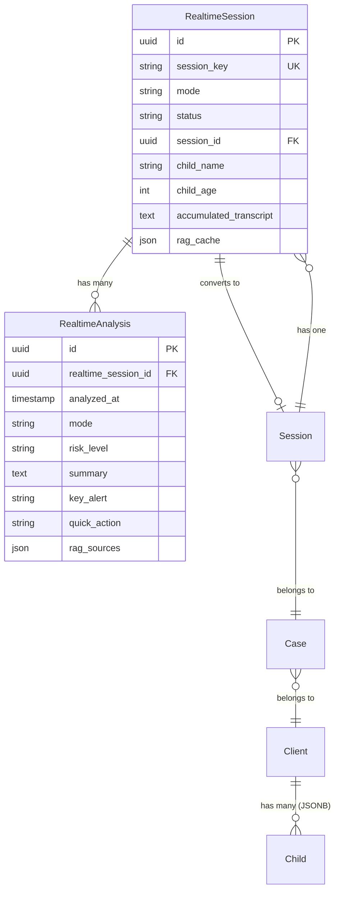
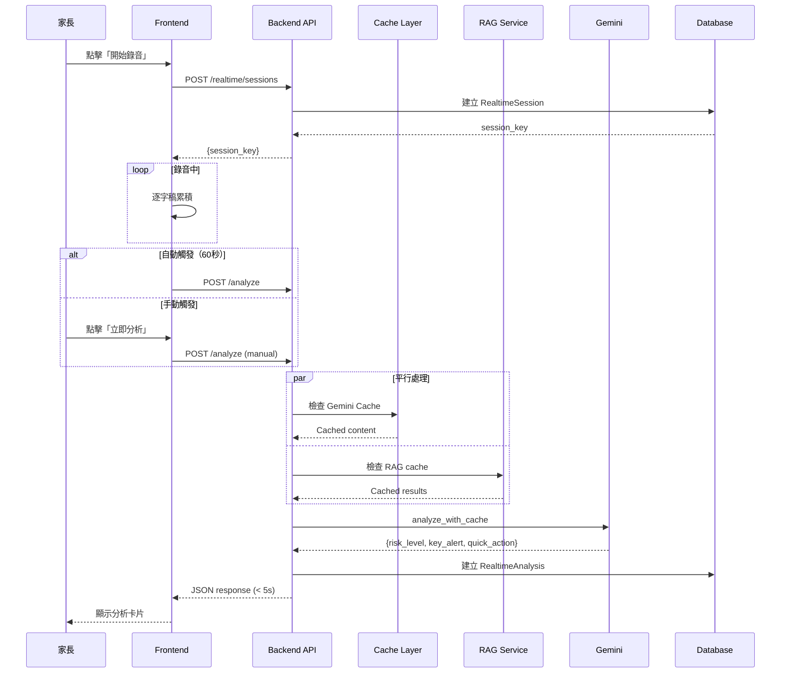
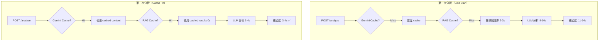
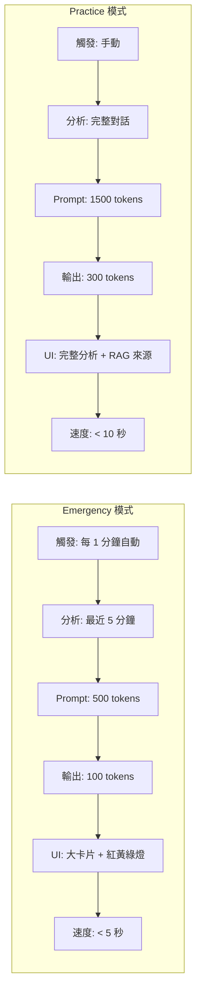
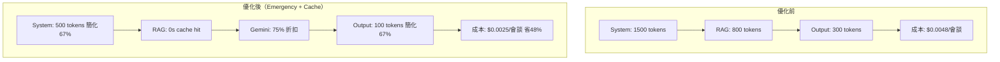
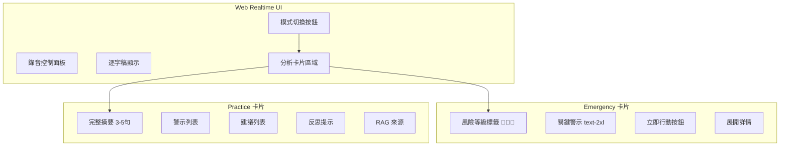
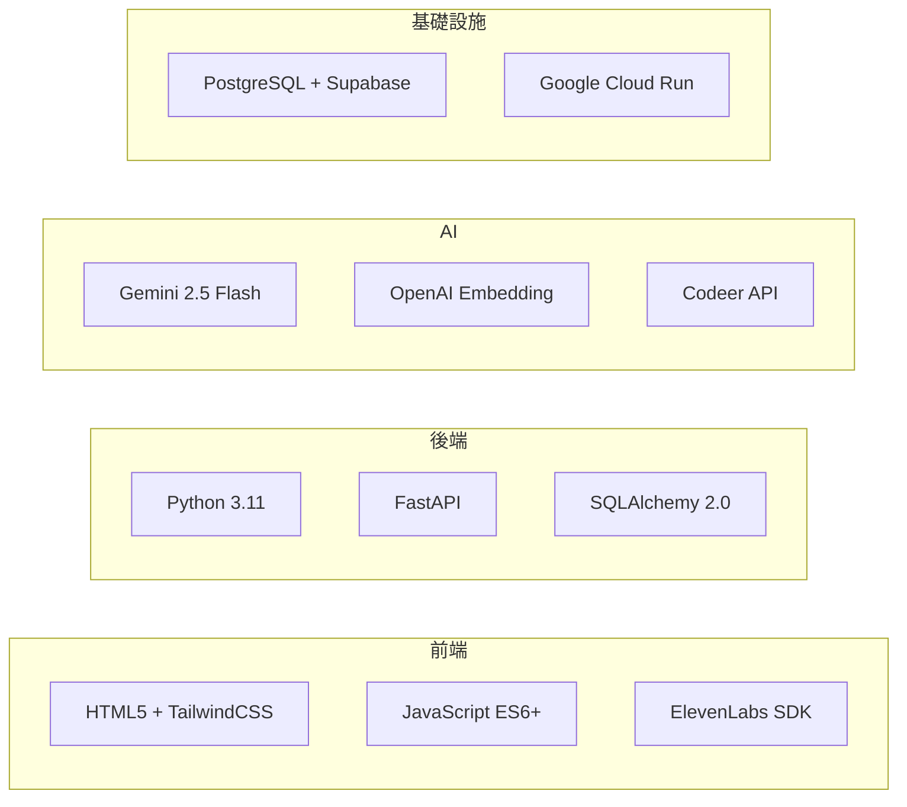
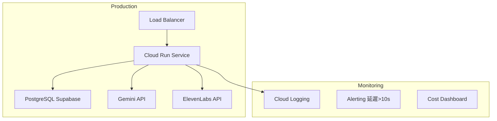

# TODO - Week of 2025-12-20

基於 2025-12-20 產品會議討論，本週待辦事項規劃。

**上週成果 (Week 50)**:
- ✅ 完成 Realtime V2 技術規格（4 份文檔，86KB）
- ✅ 修復 RAG Threshold 問題（0.7 → 0.5）
- ✅ 擴充 RAG 關鍵字（24 → 78 個）
- ✅ 實作模式切換與紅黃綠燈功能（15 integration tests 全通過）

---

## 🎯 本週優先目標 (Week 51: 2025-12-20 ~ 2025-12-26)

### 📌 三大核心任務（Backend）

---

## 任務一：Web 改版（Web Realtime Console）

### 1.1 紅綠燈卡片機制（視覺化風險等級）
**優先級**: 🔴 P0
**預估時間**: 4-6 小時
**負責**: Backend API + Frontend UI

**需求說明**:
- **紅燈（嚴重錯誤）**：家長說了很不該說的話
  - 視覺：紅色卡片 + 大字凸顯
  - 觸發頻率：縮短為 **15 秒一張卡片**（緊急機制）
  - 範例：威脅、辱罵、情緒失控

- **黃燈（有點不合適）**：可以接受但需注意
  - 視覺：黃色卡片
  - 觸發頻率：**30 秒一張卡片**
  - 範例：語氣不當、急躁、施壓

- **綠燈（表現不錯）**：溝通良好
  - 視覺：綠色卡片 + 鼓勵訊息
  - 觸發頻率：**60 秒一張卡片**（正常）
  - 範例：溫和、同理、有效策略

**Backend 開發**:
- [ ] 更新 `POST /api/v1/realtime/analyze` response schema
  ```json
  {
    "risk_level": "red" | "yellow" | "green",
    "severity": 1 | 2 | 3,  // 1=綠, 2=黃, 3=紅
    "display_text": "要顯示的一段話（簡潔版）",
    "action_suggestion": "立即可做的行動句",
    "suggested_interval_seconds": 15 | 30 | 60,  // 建議 Frontend 調整 Timer
    "keywords": [...],
    "categories": [...]
  }
  ```
- [ ] 移除 `confidence` 欄位（改用 severity）
- [ ] 實作風險等級判斷邏輯（Prompt 調整）
- [ ] 10+ integration tests

**Frontend 需配合**:
- 根據 `suggested_interval_seconds` 動態調整 Timer
- Timer 不等 API 回來，以「送出時間」為基準
- 紅黃綠視覺化（顏色、大小、動畫）

---

### 1.2 卡片合併邏輯（減少重複卡片）
**優先級**: 🟡 P1
**預估時間**: 4-5 小時
**負責**: Backend

**問題描述**:
- 家長對話又臭又長 😅
- 每 60 秒一張卡片，內容常常重複
- 一場對話結束後累積很多張，但內容大致相同

**解決方案**:
- [ ] **卡片相似度計算**
  - Backend 比較「前一張卡片」與「當前卡片」的相似度
  - 使用 embedding cosine similarity
  - 相似度閾值：> 80% 視為重複

- [ ] **API Response 新增欄位**
  ```json
  {
    "should_merge": true | false,  // 是否建議合併
    "similarity_score": 0.85,      // 與前一張卡片的相似度
    "merge_reason": "內容重複，建議保留原卡片"
  }
  ```

- [ ] **卡片歷史追蹤**
  - Session-level cache：儲存最近 5 張卡片的 embedding
  - 每次分析時，計算與前一張的相似度
  - 若相似度高，回傳 `should_merge: true`

- [ ] **Frontend 行為**
  - 收到 `should_merge: true` → 保留原卡片或合併顯示
  - 收到 `should_merge: false` → 正常顯示新卡片

**Deliverable**:
- 相似度計算邏輯
- 5+ integration tests
- API 文檔更新

---

### 1.3 覆盤統整簡化
**優先級**: 🟢 P2
**預估時間**: 2-3 小時
**負責**: Backend

**需求**:
- 使用既有格式（最大程度簡化）
- 不新增複雜邏輯
- 參考現有 `POST /api/v1/reports/generate`

**開發**:
- [ ] 確認現有報告格式適用
- [ ] 若需調整，僅做最小修改
- [ ] 不新增額外欄位或邏輯

---

## 任務二：付費版方案二 - 會員白名單系統（Web 行政人員）

**優先級**: 🔴 P0（最優先）
**預估時間**: 6-8 小時
**負責**: Backend
**參考**: 「浮島 App 付費機制」規劃文件

### 2.1 會員白名單 API（給行政人員管理）

**使用情境**:
- 行政人員在後台管理有效會員
- 付費 → 加入名單
- 到期 → Disable
- App/Web 每次啟動打 Backend 確認狀態

**API 設計**:

- [ ] **POST /api/v1/admin/whitelist/members** - 新增會員（admin only）
  ```json
  Request:
  {
    "email": "parent@example.com",
    "phone": "+886912345678",  // optional
    "expires_at": "2026-06-30T23:59:59Z",  // 到期時間
    "notes": "逗點教室家長-小明媽媽"
  }

  Response 201:
  {
    "member_id": "uuid",
    "email": "parent@example.com",
    "status": "active",
    "activated_at": "2025-12-20T10:00:00Z",
    "expires_at": "2026-06-30T23:59:59Z"
  }
  ```

- [ ] **GET /api/v1/admin/whitelist/members** - 查詢會員清單（admin only）
  ```json
  Query Parameters:
  - status: active | suspended | expired
  - limit: 20 (default)
  - offset: 0 (default)

  Response 200:
  {
    "total": 156,
    "members": [
      {
        "member_id": "uuid",
        "email": "...",
        "status": "active",
        "expires_at": "..."
      }
    ]
  }
  ```

- [ ] **PATCH /api/v1/admin/whitelist/members/:member_id** - 更新狀態（admin only）
  ```json
  Request:
  {
    "status": "suspended",  // active | suspended
    "expires_at": "2026-12-31T23:59:59Z"  // 延長或縮短
  }
  ```

- [ ] **DELETE /api/v1/admin/whitelist/members/:member_id** - 移除會員（admin only）

- [ ] **GET /api/v1/auth/verify-membership** - 驗證會員狀態（用戶端）
  ```json
  Headers:
  Authorization: Bearer <JWT>

  Response 200:
  {
    "is_member": true,
    "status": "active",
    "expires_at": "2026-06-30T23:59:59Z",
    "days_remaining": 192
  }

  Response 403 (非會員或已過期):
  {
    "is_member": false,
    "message": "會員資格已過期，請聯繫行政人員"
  }
  ```

### 2.2 資料模型

- [ ] **Whitelist Model**
  ```python
  class Whitelist(Base, BaseModel):
      __tablename__ = "whitelist_members"

      id = Column(GUID(), primary_key=True, default=uuid.uuid4)

      # 會員資訊
      counselor_id = Column(GUID(), ForeignKey("counselors.id"), unique=True, index=True)
      email = Column(String, unique=True, index=True, nullable=False)
      phone = Column(String, nullable=True)

      # 狀態管理
      status = Column(String(20), default="active", nullable=False)
      # active: 有效會員
      # suspended: 暫停（例如欠費）
      # expired: 已過期

      # 時間管理
      activated_at = Column(DateTime(timezone=True), default=datetime.utcnow)
      expires_at = Column(DateTime(timezone=True), nullable=True)
      last_verified_at = Column(DateTime(timezone=True), nullable=True)

      # 行政備註
      notes = Column(Text, nullable=True)
      created_by = Column(GUID(), ForeignKey("counselors.id"), nullable=True)

      # Multi-tenant
      tenant_id = Column(String, default="island_parents", index=True)
  ```

- [ ] **DB Migration**
  - 建立 `whitelist_members` table
  - 索引：`email`, `counselor_id`, `status`, `tenant_id`

### 2.3 權限控制

- [ ] **Admin 權限檢查**
  - 只有 `role = "admin"` 的 counselor 可以管理白名單
  - 使用 FastAPI Depends 實作權限裝飾器

- [ ] **Middleware 整合**
  - 在 Session Create/Update API 前檢查會員狀態
  - 若非有效會員 → 403 Forbidden

### 2.4 行政後台 UI（可選，優先級低）

- [ ] 簡易 HTML 頁面（類似 console.html）
- [ ] 會員清單顯示
- [ ] 新增/編輯/停權按鈕
- [ ] 搜尋功能（email, phone）

**Deliverable**:
- 5 個 API endpoints
- Whitelist model + migration
- 15+ integration tests
- API 文檔

---

## 任務三：iOS API 改版 - island_parents 租戶

**優先級**: 🔴 P0
**預估時間**: 10-12 小時
**負責**: Backend
**參考**: 會議紀錄 + 「浮島 App Pivot」文件

### 3.1 Multi-Tenant 架構擴充

**現有 Tenants**:
1. `counselor` - 諮商師（現有系統）
2. `speak_ai` - SpeakAI（現有系統）
3. **`island_parents`** - 浮島家長版（新增）✨

**Tenant 隔離策略**:
- [ ] 所有 table 都有 `tenant_id` 欄位
- [ ] API 自動注入 `tenant_id`（基於 JWT）
- [ ] Query 自動過濾 tenant（避免跨租戶資料洩漏）

---

### 3.2 Client 物件簡化（island_parents 專用）

**問題**:
- 現有 `clients` table 的 required 欄位太多：
  - email, phone, gender, birth_date, address, emergency_contact...
  - 不適合「家長建立孩子資料」的情境

**解決方案**:

**Option 1: 新增 tenant-specific schema（推薦）** ✅

- [ ] **island_parents 的 Client 只需兩個 required 欄位**:
  - `name` (String, required) - 孩子姓名或代號
  - `grade` (Integer, required) - 年級（1-12）
    - 1 = 小一, 6 = 小六, 7 = 國一, 10 = 高一, 12 = 高三
    - UI 負責顯示轉換（例如：10 → "高一"）

- [ ] **Optional 欄位**（App 動態顯示）:
  - `birth_date` (Date, optional)
  - `gender` (String, optional)
  - `notes` (Text, optional) - 家長備註（例如：「容易生氣、拒絕寫作業」）

- [ ] **DB Schema 調整**:
  ```python
  class Client(Base, BaseModel):
      # 現有欄位保持不變（counselor tenant）

      # 新增欄位（island_parents 專用）
      grade = Column(Integer, nullable=True)  # 1-12

      # 既有欄位改為 nullable（向後相容）
      email = Column(String, nullable=True)  # 改為 optional
      phone = Column(String, nullable=True)  # 改為 optional
      gender = Column(String, nullable=True)  # 改為 optional
      birth_date = Column(Date, nullable=True)  # 改為 optional
  ```

- [ ] **Schema Validation（Pydantic）**:
  ```python
  class ClientCreateIslandParents(BaseModel):
      """island_parents 租戶專用的簡化 schema"""
      name: str  # required
      grade: int  # required, 1-12
      birth_date: Optional[date] = None
      gender: Optional[str] = None
      notes: Optional[str] = None

      @validator('grade')
      def validate_grade(cls, v):
          if not 1 <= v <= 12:
              raise ValueError('年級必須在 1-12 之間')
          return v
  ```

- [ ] **API 路由分離**:
  ```python
  # 既有 API（counselor tenant）
  POST /api/v1/clients  # 需要完整欄位

  # 新增 API（island_parents tenant）
  POST /api/v1/island/clients  # 只需 name + grade
  ```

**Deliverable**:
- DB migration（新增 `grade` 欄位，既有欄位改 nullable）
- 新增 `ClientCreateIslandParents` schema
- 5+ integration tests

---

### 3.3 Session 資料結構調整

**新增欄位**:

- [ ] **scenario_topic** (String, optional)
  - 用途：事前練習時，使用者填寫「這次要練習什麼情境」
  - 範例：「孩子不寫作業」、「兄弟姊妹吵架」、「睡前拖延」
  - DB Migration：新增欄位到 `sessions` table

- [ ] **mode** (String, required)
  - `practice` - 事前練習模式
  - `emergency` - 事中實戰模式
  - 預設：`emergency`

- [ ] **partial_segments** (JSONB, default=[])
  - 儲存 partial 分析的逐字稿片段
  - 格式：
    ```json
    [
      {
        "timestamp": "2025-12-20T10:01:00Z",
        "text": "第一分鐘的逐字稿...",
        "duration_seconds": 60
      },
      {
        "timestamp": "2025-12-20T10:02:00Z",
        "text": "第二分鐘的逐字稿...",
        "duration_seconds": 60
      }
    ]
    ```

- [ ] **partial_last_updated_at** (DateTime, nullable)
  - 最後一次 partial 更新時間

**DB Migration**:
```sql
ALTER TABLE sessions
ADD COLUMN scenario_topic VARCHAR(255),
ADD COLUMN mode VARCHAR(20) DEFAULT 'emergency',
ADD COLUMN partial_segments JSONB DEFAULT '[]'::jsonb,
ADD COLUMN partial_last_updated_at TIMESTAMP WITH TIME ZONE;

CREATE INDEX idx_sessions_mode ON sessions(mode);
```

---

### 3.4 自動存檔功能（三段式 API）

**問題**:
- 現況：錄音結束後才 Create/Update Session
- 風險：API 失敗 → 後端沒有 session → **資料消失** 💀

**解法（三段式存檔）**:

#### Phase 1: 開始錄音 - Create 空 Session

- [ ] **POST /api/v1/island/sessions** - 建立空 Session
  ```json
  Request:
  {
    "client_id": "uuid",
    "case_id": "uuid",  // 可選（現階段只有一個 Case）
    "mode": "emergency" | "practice",
    "scenario_topic": "孩子不寫作業",  // practice mode 需填
    "started_at": "2025-12-20T10:00:00Z"
  }

  Response 201:
  {
    "session_id": "uuid",
    "client_id": "uuid",
    "mode": "emergency",
    "scenario_topic": "孩子不寫作業",
    "started_at": "2025-12-20T10:00:00Z",
    "status": "in_progress"
  }
  ```

- [ ] **行為**:
  - 建立空 session（只有 `started_at`）
  - `transcript` 為空
  - `status = "in_progress"`
  - 回傳 `session_id` 給 App

---

#### Phase 2: 錄音中 - Partial 分析 API

- [ ] **POST /api/v1/island/sessions/:session_id/analyze-partial** - Partial 分析
  ```json
  Request:
  {
    "transcript_segment": "最近這 60 秒的逐字稿",
    "timestamp": "2025-12-20T10:01:00Z",
    "duration_seconds": 60
  }

  Response 200:
  {
    "risk_level": "yellow",
    "severity": 2,
    "display_text": "家長語氣有點急躁",
    "action_suggestion": "深呼吸 3 次，放慢語速",
    "suggested_interval_seconds": 30,  // 建議改 30 秒
    "should_merge": false,
    "keywords": ["急躁", "作業"],
    "categories": ["情緒管理"]
  }
  ```

- [ ] **行為**:
  1. 儲存 partial segment 到 `partial_segments` JSONB 欄位
  2. 執行即時分析（紅黃綠燈判斷）
  3. 計算與前一張卡片的相似度
  4. 回傳分析結果（含 `should_merge`）
  5. 更新 `partial_last_updated_at`

- [ ] **Backup 機制**:
  - 每次 partial 都儲存到 DB
  - 若最後 Update 失敗，可用 partial_segments 重建完整逐字稿

---

#### Phase 3: 結束錄音 - Update 完整逐字稿

- [ ] **PATCH /api/v1/island/sessions/:session_id/complete** - 完成 Session
  ```json
  Request:
  {
    "full_transcript": "完整逐字稿（App 端整合好的）",
    "ended_at": "2025-12-20T10:30:00Z"
  }

  Response 200:
  {
    "session_id": "uuid",
    "status": "completed",
    "started_at": "2025-12-20T10:00:00Z",
    "ended_at": "2025-12-20T10:30:00Z",
    "duration_seconds": 1800,
    "transcript_length": 5432,
    "partial_segments_count": 30  // 備份了 30 個片段
  }
  ```

- [ ] **行為**:
  1. 更新 `transcript` 為完整逐字稿
  2. 更新 `ended_at` 和 `status = "completed"`
  3. 計算 `duration_seconds`
  4. 若 `full_transcript` 為空或失敗，使用 `partial_segments` 拼接（fallback）

- [ ] **Fallback 機制**:
  ```python
  def get_transcript_with_fallback(session):
      if session.transcript:
          return session.transcript
      else:
          # 拼接 partial_segments
          segments = session.partial_segments or []
          return "\n\n".join([seg["text"] for seg in segments])
  ```

---

#### 補充：結束時補齊最後一段

- [ ] **App 端行為**:
  - 使用者按「結束錄音」時
  - 立即觸發最後一個 `analyze-partial`（不等 timer）
  - 確保最後一段也被儲存

**Deliverable**:
- 3 個 API endpoints（Create / Partial / Complete）
- Session model 更新（新增 4 個欄位）
- Fallback 機制實作
- 20+ integration tests（正常流程 + 失敗 fallback）

---

### 3.5 即時分析 API 改版

**參考**: 任務一的 Web 改版（紅黃綠燈機制）

- [ ] 使用相同的 response schema
- [ ] island_parents 租戶專用的 Prompt 調整
- [ ] RAG 知識庫：使用親子教養相關知識（而非諮商專業）

---

### 3.6 Case 管理簡化

**現階段**:
- **Only One Case**（固定大目標）
- 每次談話：新的 Session（不同小主題）

**實作**:

- [ ] **預設 Case 自動建立**
  - 當 island_parents 租戶第一次建立 Client 時
  - 自動建立一個預設 Case：「親子溝通成長」
  - `case_id` 自動關聯到所有 Session

- [ ] **API 簡化**
  - App 不需要自己建立 Case
  - Create Session 時，若 `case_id` 為空，自動使用預設 Case

**Deliverable**:
- 預設 Case 自動建立邏輯
- 3+ integration tests

---

## 任務四：密碼管理與通知系統

**優先級**: 🔴 P0
**預估時間**: 6-8 小時
**負責**: Backend
**影響範圍**: Web Admin + iOS App

### 4.1 帳號建立後自動發送密碼信件

**需求說明**:
- 當管理員在後台建立新會員帳號時，系統應自動發送包含密碼的歡迎信件給用戶
- 信件應包含：登入網址、帳號（Email）、初始密碼、首次登入提示

**開發**:

- [ ] **整合 Email 服務**
  - 選擇 Email 服務商（SendGrid / AWS SES / SMTP）
  - 設定 Email 模板
  - 環境變數配置（API Key、發件人地址）

- [ ] **信件模板設計**
  ```html
  主旨：歡迎加入浮島諮詢系統

  內容：
  - 歡迎訊息
  - 登入網址：https://your-domain.com/admin
  - 您的帳號：{email}
  - 初始密碼：{password}
  - 建議首次登入後立即修改密碼
  ```

- [ ] **修改會員建立 API**
  - 在 `POST /api/v1/admin/counselors` 成功建立後
  - 觸發異步任務發送 Email
  - 記錄發送狀態（成功/失敗）

- [ ] **Email 發送日誌**
  ```python
  class EmailLog(Base):
      id = Column(GUID(), primary_key=True)
      recipient_email = Column(String, nullable=False)
      email_type = Column(String)  # "welcome", "password_reset"
      status = Column(String)  # "sent", "failed", "pending"
      sent_at = Column(DateTime(timezone=True))
      error_message = Column(Text, nullable=True)
  ```

**Deliverable**:
- Email 服務整合
- 歡迎信件模板
- Email 日誌模型
- 5+ integration tests

---

### 4.2 密碼重設頁面（Web）

**需求說明**:
- 提供 Web 頁面讓用戶可以自行重設密碼
- 流程：輸入 Email → 收到重設連結 → 設定新密碼

**開發**:

- [ ] **密碼重設請求頁面**
  - URL: `/reset-password`
  - 輸入欄位：Email
  - 提交後顯示「已發送重設連結」訊息

- [ ] **密碼重設 Token 生成**
  ```python
  class PasswordResetToken(Base):
      id = Column(GUID(), primary_key=True)
      counselor_id = Column(GUID(), ForeignKey("counselors.id"))
      token = Column(String(64), unique=True, index=True)
      expires_at = Column(DateTime(timezone=True))  # 有效期 1 小時
      used = Column(Boolean, default=False)
      created_at = Column(DateTime(timezone=True))
  ```

- [ ] **密碼重設確認頁面**
  - URL: `/reset-password/confirm?token={token}`
  - 驗證 Token 有效性
  - 輸入欄位：新密碼、確認密碼
  - 提交後更新密碼並標記 Token 為已使用

- [ ] **發送密碼重設信件**
  ```html
  主旨：密碼重設請求

  內容：
  - 收到密碼重設請求
  - 重設連結：https://your-domain.com/reset-password/confirm?token={token}
  - 連結有效期：1 小時
  - 若非本人操作，請忽略此信件
  ```

**Deliverable**:
- 2 個 Web 頁面（請求 + 確認）
- PasswordResetToken 模型
- Email 通知整合
- 8+ integration tests

---

### 4.3 密碼重設 API（給 iOS 使用）

**需求說明**:
- iOS App 需要 API 來實現密碼重設功能
- 流程與 Web 相同，但使用 API 而非頁面

**API 設計**:

- [ ] **POST /api/v1/auth/password-reset/request** - 請求密碼重設
  ```json
  Request:
  {
    "email": "user@example.com"
  }

  Response 200:
  {
    "message": "密碼重設信件已發送，請檢查您的信箱",
    "expires_in_minutes": 60
  }

  Response 404:
  {
    "detail": "找不到此 Email 的帳號"
  }
  ```

- [ ] **POST /api/v1/auth/password-reset/verify** - 驗證 Token
  ```json
  Request:
  {
    "token": "abc123..."
  }

  Response 200:
  {
    "valid": true,
    "email": "user@example.com"
  }

  Response 400:
  {
    "valid": false,
    "reason": "Token 已過期或無效"
  }
  ```

- [ ] **POST /api/v1/auth/password-reset/confirm** - 確認重設密碼
  ```json
  Request:
  {
    "token": "abc123...",
    "new_password": "NewSecurePass123"
  }

  Response 200:
  {
    "message": "密碼已成功重設"
  }

  Response 400:
  {
    "detail": "Token 無效或已使用"
  }
  ```

**安全考量**:
- [ ] Token 應使用加密隨機字串（至少 32 字元）
- [ ] Token 有效期 1 小時
- [ ] Token 只能使用一次
- [ ] 密碼強度驗證（至少 6 字元）
- [ ] 限制請求頻率（同一 Email 5 分鐘內只能請求一次）

**Deliverable**:
- 3 個 API endpoints
- 請求頻率限制邏輯
- 10+ integration tests（正常流程 + 錯誤處理）
- API 文檔更新

---

### 4.4 整合測試與文檔

- [ ] **完整流程測試**
  - 建立帳號 → 收到歡迎信
  - 請求密碼重設 → 收到重設信 → 成功重設密碼
  - Token 過期處理
  - Token 重複使用防護

- [ ] **API 文檔更新**
  - Swagger UI 更新
  - 在 `點數管理後台.md` 添加密碼重設說明

- [ ] **環境變數文檔**
  ```env
  # Email 服務配置
  EMAIL_PROVIDER=sendgrid  # sendgrid / ses / smtp
  EMAIL_API_KEY=your_api_key
  EMAIL_FROM_ADDRESS=noreply@your-domain.com
  EMAIL_FROM_NAME=浮島諮詢系統

  # 密碼重設配置
  PASSWORD_RESET_TOKEN_EXPIRY_HOURS=1
  PASSWORD_RESET_RATE_LIMIT_MINUTES=5
  ```

**Deliverable**:
- 完整流程測試（20+ tests）
- 用戶文檔更新
- 開發者文檔（環境變數、部署指南）

---

## 📊 本週 KPI（更新版）

### 開發進度
- 🎯 完成 4 大任務（Web 改版 + 付費版 + iOS API + 密碼管理）
- 🎯 60+ integration tests 新增
- 🎯 6+ DB migrations

### API 交付
- 🎯 Web 改版：2 APIs（即時分析改版 + 卡片合併）
- 🎯 付費版：5 APIs（白名單管理）
- 🎯 iOS API：3 APIs（Create / Partial / Complete）
- 🎯 密碼管理：3 APIs（密碼重設請求/驗證/確認）

### 性能目標
- 🎯 即時分析 API：< 10 秒（含紅黃綠判斷）
- 🎯 Partial 分析 API：< 5 秒
- 🎯 卡片相似度計算：< 1 秒

### 品質目標
- 🎯 Test coverage：> 80%（新代碼）
- 🎯 Ruff check：0 errors
- 🎯 所有 integration tests：100% 通過

---

## ✅ 本週完成檢查清單（更新版）

### 必須完成（P0）- 優先順序由高到低

#### 任務二：付費版（最優先）
- [ ] 會員白名單 API（5 endpoints）
- [ ] Whitelist model + migration
- [ ] 權限控制實作
- [ ] 15+ integration tests

#### 任務三：iOS API 改版
- [ ] Client 簡化（name + grade）
- [ ] Session 新增欄位（scenario_topic, mode, partial_segments）
- [ ] 自動存檔三段式 API（Create / Partial / Complete）
- [ ] 預設 Case 自動建立
- [ ] 20+ integration tests
- [ ] 2+ DB migrations

#### 任務一：Web 改版
- [ ] 即時分析 API 改版（紅黃綠燈 + 動態頻率）
- [ ] 卡片合併邏輯（相似度計算）
- [ ] 10+ integration tests

#### 任務四：密碼管理與通知系統
- [ ] Email 服務整合（SendGrid / AWS SES）
- [ ] 帳號建立後自動發送密碼信件
- [ ] 密碼重設頁面（Web）
- [ ] 密碼重設 API（3 endpoints for iOS）
- [ ] PasswordResetToken model + EmailLog model
- [ ] 20+ integration tests
- [ ] 1+ DB migration

### 建議完成（P1）
- [ ] 行政後台 UI（簡易版）
- [ ] 覆盤統整簡化
- [ ] API 文檔完整更新

### 可選完成（P2）
- [ ] 增量傳輸優化實驗
- [ ] Frontend 整合測試
- [ ] 監控儀表板設計

---

## 📝 會議決策記錄（2025-12-20）- 更新版

### 技術決策
1. **Timer 由 Client 端主控** - 不等 API 回來，避免被延遲拖慢
2. **三個 tenant_id** - counselor, speak_ai, **island_parents**（新增）
3. **自動存檔機制** - 三段式（Create → Partial → Complete），防資料遺失
4. **付費機制優先順序** - 會員白名單（方案二）> 兌換碼（方案一）
5. **卡片合併** - 用 embedding 相似度（> 80%）判斷
6. **Client 簡化** - island_parents 只需 name + grade

### 產品決策
1. **紅黃綠燈動態頻率** - 紅 15s / 黃 30s / 綠 60s
2. **卡片互動** - 減少重複卡片，相似內容合併或保留原卡片
3. **覆盤統整** - 使用既有格式，不新增複雜邏輯
4. **Case 管理** - 現階段只有一個預設 Case（自動建立）

### 待討論
- [ ] 卡片相似度閾值（80%？85%？）
- [ ] Partial segments 保存多久？（7 天 / 30 天）
- [ ] 會員白名單匯入流程（CSV？API？手動？）
- [ ] island_parents 的 RAG 知識庫內容範圍

---

## 🔄 下週預覽（Week 52: 2025-12-27 ~ 2026-01-02）

### 前端整合
- 完成 Web Realtime 紅黃綠燈 UI
- 卡片合併視覺化
- 動態 Timer 測試

### iOS App 整合
- 三段式自動存檔測試
- 簡化 Client 建立流程
- Partial 分析流程測試

### 行政後台上線
- 會員白名單管理系統
- Admin 權限測試
- Staging 部署

---

### 🚨 核心功能開發（基於 2025-12-20 會議）

#### 1. 即時分析 API 改版（紅黃綠燈機制 + 動態 Timer）
**優先級**: 🔴 P0（最高優先）
**預估時間**: 6-8 小時
**參考**: 會議紀錄「重點整理」第 1-6 點

**核心需求**:
- [ ] **Timer 動態調整（Client 端主控）**
  - 預設：60 秒發送一次
  - 紅燈：15 秒
  - 黃燈：30 秒
  - 綠燈：60 秒
  - ⚠️ Timer 不等 API 回來，以「送出時間」為基準

- [ ] **API Response 結構調整**
  - 修改 `POST /api/v1/sessions/:session_id/analyze-keywords`
  - 移除：`confidence` 欄位
  - 新增：`risk_level` (red|yellow|green)
  - 新增：`severity` (1/2/3，對應綠黃紅)
  - 新增：`display_text` (要顯示的一段話)
  - 新增：`action_suggestion` (行動句)
  - 保留：`keywords`, `categories`, `counselor_insights`

- [ ] **增量傳輸優化（成本優化）**
  - Phase 1 (MVP): 整段上下文傳輸（先求效果）
  - Phase 2 (優化): 只送新增片段，後端累積
  - 後端：累積 partial segments 成完整逐字稿

- [ ] **紅黃綠判斷邏輯（避免「紅燈永遠紅」）**
  - 考慮上一次警訊的時效性
  - 實驗：提供「diff」給模型（舊稿 + 新增稿）
  - 讓模型判斷警訊是否仍然成立

**Deliverable**:
- 更新 API response schema
- 實作風險等級判斷邏輯
- 10+ integration tests 通過

---

#### 2. Session 資料結構調整（事前/事中模式）
**優先級**: 🔴 P0
**預估時間**: 4-6 小時
**參考**: 會議紀錄「重點整理」第 7 點

- [ ] **Session 新增「情境主題」欄位**
  - 欄位名稱：`scenario_topic` (String)
  - 用途：事前練習時，使用者填寫「這次要練習什麼情境」
  - 範例：「孩子不寫作業」、「兄弟姊妹吵架」、「睡前拖延」
  - DB Migration：新增欄位到 `sessions` table
  - Schema：更新 `SessionCreate` / `SessionUpdate`

- [ ] **Case / Session 關係釐清**
  - 現階段：**Only One Case**（固定大目標）
  - 每次談話：新的 Session（不同小主題）
  - Session 開始前：填寫 `scenario_topic`

- [ ] **事前/事中 API 參數設計**
  - Create Session 時指定 `mode`: "practice" | "emergency"
  - Practice mode: 需填 `scenario_topic`
  - Emergency mode: `scenario_topic` optional

**Deliverable**:
- Migration script
- 更新 Session schemas
- API 支援 `scenario_topic`

---

#### 3. IslandParent 租戶 - Client (孩子) 物件簡化
**優先級**: 🟡 P1
**預估時間**: 4-5 小時
**參考**: 會議紀錄「重點整理」第 8-9 點

- [ ] **新增 IslandParent tenant schema**
  - 避免破壞現有 counselor tenant
  - 使用獨立的 Client schema（簡化版）

- [ ] **Client Required 欄位最小化**
  - `name` (String, required) - 姓名或代號
  - `grade` (Integer, required) - 年級（1-12）
    - 1 = 小一, 6 = 小六, 7 = 國一, 12 = 高三
    - UI 負責轉換顯示文字（例如：10 → "高一"）
  - 其他欄位 (optional)：
    - `email`, `phone`, `gender`, `birth_date` 等

- [ ] **動態 Form 表單設計（App 端考量）**
  - 如果 optional 欄位存在，動態顯示 form
  - 否則，只需填 `name` + `grade`

- [ ] **DB Migration**
  - 修改 `clients` table：
    - `grade` (Integer, nullable=True) 新增欄位
    - 既有欄位改為 nullable（向後相容）
  - 或建立新 table：`island_parent_clients`

**Deliverable**:
- Migration script
- 簡化版 Client schema
- 2+ integration tests

---

#### 4. 自動存檔功能（防止資料遺失）
**優先級**: 🔴 P0（關鍵可靠性）
**預估時間**: 6-8 小時
**參考**: 會議紀錄「重點整理」第 10-11 點

**問題**:
- 現況：錄音結束後才 Create/Update Session
- 風險：API 失敗 → 後端沒有 session → 資料消失

**解法（三段式存檔）**:

- [ ] **Phase 1: 開始錄音 - Create 空 Session**
  ```
  POST /api/v1/sessions
  {
    "client_id": "xxx",
    "case_id": "xxx",
    "mode": "emergency",
    "scenario_topic": "",  # 可選
    "started_at": "2025-12-20T10:00:00Z"
  }
  ```
  - 建立空 session（只有 `started_at`）
  - 回傳 `session_id` 給 App

- [ ] **Phase 2: 錄音中 - Partial 分析 API**
  ```
  POST /api/v1/sessions/:session_id/analyze-partial
  {
    "transcript_segment": "最近這 60 秒的逐字稿",
    "accumulated_transcript": "從開始到現在的完整逐字稿"  # 可選
  }
  ```
  - 後端累積 `partial_segments`（JSONB array）
  - 同時執行即時分析（紅黃綠燈）
  - 儲存分析結果

- [ ] **Phase 3: 結束錄音 - Update 完整逐字稿**
  ```
  PATCH /api/v1/sessions/:session_id
  {
    "full_transcript": "完整逐字稿",
    "ended_at": "2025-12-20T10:30:00Z",
    "status": "completed"
  }
  ```
  - 更新 session 狀態
  - 若失敗：使用 `partial_segments` 重建逐字稿（fallback）

- [ ] **結束時補齊最後一段**
  - App 按「結束」時，立即觸發最後一個 partial
  - 不等下一個 timer 週期

- [ ] **Backup 機制**
  - Session table 新增：`partial_segments` (JSONB)
  - 每次 partial 都儲存
  - 若 `full_transcript` 為空，產報告時用 partial 拼接

**DB Schema 更新**:
```python
class Session(Base):
    # 新增欄位
    partial_segments = Column(JSON, default=list)
    # [
    #   {"timestamp": "10:01:00", "text": "..."},
    #   {"timestamp": "10:02:00", "text": "..."}
    # ]
    partial_last_updated_at = Column(DateTime(timezone=True))
```

**Deliverable**:
- 3 個 API endpoints（Create / Partial / Update）
- Migration script
- 15+ integration tests（正常流程 + 失敗 fallback）

---

#### 5. 浮島 App 付費機制（兌換碼系統）
**優先級**: 🟡 P1（下週可開始）
**預估時間**: 8-10 小時
**參考**: 「浮島 App 付費機制」規劃文件

**方案一：App 外收款 + 兌換碼驗證**

- [ ] **兌換碼管理 API**
  - `POST /api/v1/redeem-codes/generate` - 產生兌換碼
  - `POST /api/v1/redeem-codes/verify` - 驗證兌換碼
  - `GET /api/v1/redeem-codes/:code` - 查詢兌換碼狀態
  - `PATCH /api/v1/redeem-codes/:code/revoke` - 停權

- [ ] **兌換碼資料模型**
  ```python
  class RedeemCode(Base):
      code = Column(String(16), unique=True, index=True)  # XXXX-XXXX-XXXX
      hours_quota = Column(Integer, default=60)  # 60 小時額度
      hours_used = Column(Integer, default=0)
      status = Column(String(20), default="active")  # active/revoked/expired
      expires_at = Column(DateTime(timezone=True))
      created_by = Column(String)  # admin user
      redeemed_by = Column(GUID(), ForeignKey("counselors.id"))
      redeemed_at = Column(DateTime(timezone=True))
  ```

- [ ] **使用限制機制**
  - 每日上限：例如 3 小時/天
  - 每月上限：例如 20 小時/月
  - 總時數上限：60 小時
  - 超過上限：API 回傳 403 Forbidden

- [ ] **Session 使用時數計算**
  - Session 結束時，計算 `duration_seconds`
  - 扣除對應 `RedeemCode.hours_used`
  - 檢查是否超過額度

**方案二：會員白名單（既有學員）**

- [ ] **會員白名單 API**
  - `POST /api/v1/whitelist/add` - 新增會員（admin only）
  - `DELETE /api/v1/whitelist/:counselor_id` - 移除會員
  - `GET /api/v1/whitelist/verify` - 驗證會員狀態

- [ ] **會員白名單資料模型**
  ```python
  class Whitelist(Base):
      counselor_id = Column(GUID(), ForeignKey("counselors.id"), unique=True)
      email = Column(String, unique=True, index=True)
      status = Column(String(20), default="active")  # active/suspended
      activated_at = Column(DateTime(timezone=True))
      expires_at = Column(DateTime(timezone=True), nullable=True)
  ```

**Deliverable**:
- 兌換碼系統 API（4 endpoints）
- 會員白名單 API（3 endpoints）
- 使用限制邏輯
- 10+ integration tests

---

#### 6. 個案報告改版 -「育兒談話分析」
**優先級**: 🟢 P2（下下週）
**預估時間**: 6-8 小時
**參考**: 會議紀錄「重點整理」第 3 點

- [ ] **新增「育兒談話分析」API**
  ```
  POST /api/v1/reports/parenting-analysis
  {
    "session_id": "xxx",
    "mode": "practice" | "emergency"
  }
  ```

- [ ] **事前/事中參數差異**
  - Practice mode:
    - 完整分析：摘要、警示、建議、反思提示
    - 理論引用（RAG 來源）
    - 學習重點
  - Emergency mode:
    - 簡化分析：關鍵事件、快速建議
    - 行動檢核清單

- [ ] **報告格式設計**
  - 使用既有格式（最大程度簡化）
  - 不新增複雜邏輯
  - 參考現有 `Generate Report` API

**Deliverable**:
- 新 API endpoint
- 報告模板（Markdown）
- 5+ integration tests

---

#### 7. Web 改版需求（UI 優化）
**優先級**: 🟡 P1（前端協作）
**預估時間**: 6-8 小時（前後端合計）
**參考**: 「Web 改版」需求

- [ ] **紅黃綠燈卡片視覺化**
  - 紅燈：嚴重錯誤，紅色卡片 + 大字凸顯
  - 黃燈：有點不合適，黃色卡片
  - 綠燈：表現不錯，綠色卡片 + 鼓勵訊息

- [ ] **卡片合併邏輯（減少重複）**
  - 問題：60 秒一張卡片，內容常重複
  - 解法：
    - Backend 判斷「前後兩張卡片相似度」
    - 若相似度 > 80%，回傳 `merge: true`
    - Frontend 保留原卡片或合併顯示
  - 實作：使用 embedding cosine similarity

- [ ] **覆盤統整簡化**
  - 使用既有格式（不新增邏輯）
  - 最大程度簡化
  - 參考現有 Session Summary API

**Frontend 需配合**:
- 動態 Timer 調整（紅 15s / 黃 30s / 綠 60s）
- 卡片視覺化（顏色、大小、動畫）
- 卡片合併 UI

**Deliverable**:
- Backend: 相似度計算 API
- Frontend: 卡片 UI 更新
- E2E 測試

---

### 🧪 測試計劃（本週）

#### Integration Tests（新增 30+ tests）
- [ ] `test_analyze_api_risk_level_red` - 紅燈判斷
- [ ] `test_analyze_api_risk_level_yellow` - 黃燈判斷
- [ ] `test_analyze_api_risk_level_green` - 綠燈判斷
- [ ] `test_session_auto_save_create` - 自動存檔（建立）
- [ ] `test_session_partial_analysis` - Partial 分析
- [ ] `test_session_update_full_transcript` - 更新完整逐字稿
- [ ] `test_session_fallback_partial_segments` - Fallback 機制
- [ ] `test_redeem_code_generate` - 兌換碼產生
- [ ] `test_redeem_code_verify` - 兌換碼驗證
- [ ] `test_usage_quota_daily_limit` - 每日上限
- [ ] `test_usage_quota_total_limit` - 總時數上限
- [ ] `test_client_island_parent_simple` - 簡化 Client 建立
- [ ] `test_card_similarity_merge` - 卡片合併邏輯

---

## 📊 本週目標 KPI

### 開發進度
- 🎯 完成 7 個核心功能（即時分析改版、自動存檔、付費機制等）
- 🎯 30+ integration tests 新增
- 🎯 3+ DB migrations

### 性能目標
- 🎯 即時分析 API：< 10 秒（含紅黃綠判斷）
- 🎯 Partial 分析 API：< 5 秒
- 🎯 卡片相似度計算：< 1 秒

### 品質目標
- 🎯 Test coverage：> 80%（新代碼）
- 🎯 Ruff check：0 errors
- 🎯 所有 integration tests：100% 通過

---

## 🔄 下週預覽（Week 52: 2025-12-27 ~ 2026-01-02）

### 前端整合
- 完成 Web Realtime 紅黃綠燈 UI
- 卡片合併視覺化
- 動態 Timer 測試

### 浮島 App 付費上線
- 兌換碼系統測試
- 會員白名單導入
- Staging 部署

### 個案報告改版
- 育兒談話分析 API 上線
- 報告模板優化

---

## 📝 會議決策記錄（2025-12-20）

### 技術決策
1. **Timer 由 Client 端主控** - 不等 API 回來，避免被延遲拖慢
2. **增量傳輸分階段** - 先整段（求效果），再優化（省成本）
3. **紅黃綠時效性** - 避免「紅燈永遠紅」，考慮警訊時效
4. **自動存檔機制** - 三段式（Create → Partial → Update），防資料遺失
5. **付費機制優先順序** - App 外收款 + 兌換碼（最快上線）

### 產品決策
1. **卡片互動** - 減少重複卡片，相似內容合併
2. **覆盤統整** - 使用既有格式，不新增複雜邏輯
3. **孩子資料** - 最小化 required 欄位（name + grade）
4. **Case/Session 關係** - 現階段只有一個 Case

### 待討論
- [ ] 卡片相似度閾值（多少 % 算相似？）
- [ ] Partial segments 保存多久？（7 天 / 30 天）
- [ ] 兌換碼格式（XXXX-XXXX-XXXX？）
- [ ] 會員白名單匯入流程（CSV？API？）

---

## ✅ 完成檢查清單（本週）

### 必須完成（P0）
- [ ] 即時分析 API 改版（紅黃綠燈 + 新欄位）
- [ ] Session 新增 `scenario_topic` 欄位
- [ ] 自動存檔三段式 API（Create / Partial / Update）
- [ ] 15+ integration tests 通過
- [ ] 2+ DB migrations

### 建議完成（P1）
- [ ] IslandParent Client 簡化
- [ ] 兌換碼系統 API
- [ ] 會員白名單 API
- [ ] 卡片合併邏輯

### 可選完成（P2）
- [ ] 育兒談話分析 API
- [ ] 增量傳輸優化實驗
- [ ] Frontend 整合測試

---

## 📚 參考文件

### 會議紀錄
- 2025-12-20 產品會議重點整理（1500 字）
- 浮島 App 付費機制規劃
- Web 改版需求

### 技術規格
- `docs/TECH_SPEC_PARENTING_REALTIME_V2.md`
- `docs/ARCHITECTURE_PARENTING_REALTIME_V2.md`

---

**版本**: Week 51 (2025-12-20)
**最後更新**: 2025-12-20 10:00
**下次更新**: 2025-12-27（下週檢討會議後）

---

<details>
<summary><strong>⬇️ 上週完成事項（Week 50: 2025-12-13 ~ 2025-12-19）</strong></summary>

### 1. 完成親子即時諮詢 V2 架構規劃 ✅
**狀態**: 已完成（2025-12-13）
**交付文檔**:
- [x] 完整技術規格（58KB）- `docs/TECH_SPEC_PARENTING_REALTIME_V2.md`
- [x] 快速參考摘要（9.9KB）- `docs/TECH_SPEC_PARENTING_REALTIME_V2_SUMMARY.md`
- [x] 架構圖集（11KB，9 個 Mermaid 圖）- `docs/ARCHITECTURE_PARENTING_REALTIME_V2.md`
- [x] 文檔索引（6.7KB）- `docs/PARENTING_REALTIME_V2_INDEX.md`

**核心決策**:
- ✅ 雙模式設計：Emergency (< 5s) + Practice (< 10s)
- ✅ API 路徑分離：即時分析 vs 錄音歸檔
- ✅ 資料模型：RealtimeSession + RealtimeAnalysis
- ✅ 速度優化：11-14s → < 5s（64% 提升）
- ✅ 成本優化：省 48%（Emergency prompt 簡化）

### 2. 修復 RAG Threshold 問題 ✅
**狀態**: 已完成（2025-12-13）
**問題**: similarity_threshold=0.7 太高，導致 RAG 無法檢索相關知識
**解決**: 降至 0.5（基於生產數據分析，實際相似度最高 ~0.54-0.59）
**Commit**: `e81aa4c` - fix: lower RAG similarity threshold from 0.7 to 0.5

**已更新**:
- [x] `app/api/realtime.py` - 降低 threshold + 添加文檔註解
- [x] `tests/integration/test_realtime_rag_integration.py` - 更新測試斷言
- [x] `CHANGELOG.md` + `CHANGELOG_zh-TW.md` - 記錄修復

### 3. 擴充 RAG 關鍵字列表 ✅
**狀態**: 已完成（2025-12-13）
**成果**: 從 24 個關鍵字擴充至 78 個
**分類**:
- 基本詞彙（13）：親子、孩子、小孩、教養、育兒、管教等
- 情緒相關（13）：生氣、憤怒、焦慮、擔心、壓力、哭泣等
- 行為問題（8）：打人、攻擊、發脾氣、叛逆、不聽話等
- 日常場景（8）：功課、作業、睡覺、刷牙、吃飯等
- 人際關係（8）：手足、兄弟、姊妹、朋友、同學等
- 教養概念（14）：鼓勵、讚美、處罰、獎勵、責任、界限等
- 發展相關（9）：發展、成長、獨立、自律、自信等
- 依附相關（5）：依附、安全感、信任、分離、連結

**影響**: 提高 RAG 觸發精準度，覆蓋更多實際使用場景

---

## 📋 本週剩餘任務（Week 50: 2025-12-13 ~ 2025-12-19）

### 🚀 立即開始：Realtime 模式切換與紅綠燈功能

#### 💎 核心需求（用戶要求，立即實作）
**優先級**: 🔴 P0（最高優先）
**預估時間**: 4-6 小時
**負責人**: Backend (Young)

**需求 1: 模式切換功能**
- [ ] **事前練習模式（Practice）**
  - 卡片資訊：像現在一樣多（完整的 summary + alerts + suggestions）
  - 提供詳細分析、理論引用、反思提示
  - 目標：學習與成長

- [ ] **事中實戰模式（Emergency）**
  - 卡片資訊：極簡化，兩句話以內
  - 格式：一個大標題心法 + 一個實作操作
  - 目標：快速可執行、不打斷對話

**需求 2: Prompt 分離重構**
- [ ] 分離 Emergency prompt（簡化版，500 tokens）
- [ ] 分離 Practice prompt（完整版，1500 tokens）
- [ ] 設計不同的輸出格式（Emergency vs Practice）

**需求 3: 紅黃綠燈風險指示**
- [ ] 🔴 **紅燈（高危險）**
  - 偵測條件：家長情緒失控、暴力傾向、極端語言
  - 顯示：醒目紅色卡片、緊急建議

- [ ] 💛 **黃燈（有點危險）**
  - 偵測條件：情緒升高、衝突加劇、不當語氣
  - 顯示：黃色卡片、注意提醒

- [ ] 💚 **綠燈（安全/做得好）**
  - 偵測條件：溫和溝通、正向互動、有效策略
  - 顯示：綠色卡片、鼓勵與肯定

**實作步驟（TDD）**:

**Phase 1: RED（測試先行）** 🔴 ✅ 完成
1. [x] 撰寫 integration tests（定義預期行為）
   - [x] `tests/integration/test_realtime_mode_switching.py`（完成）
   - [x] 15 測試案例：emergency mode, practice mode, risk levels
   - [x] 確認所有測試 FAIL（RED phase）

**Phase 2: GREEN（實作代碼）** 🟢 ✅ 完成
2. [x] 更新 `app/schemas/realtime.py` - 新增 enums 和欄位
   - [x] `CounselingMode` enum (emergency, practice)
   - [x] `RiskLevel` enum (red, yellow, green)
   - [x] 新增到 Request/Response schemas
3. [x] 更新 `app/api/realtime.py` - 實作模式切換邏輯
   - [x] `_assess_risk_level()` - 風險評估函數
   - [x] `_build_emergency_prompt()` - 簡化 prompt
   - [x] `_build_practice_prompt()` - 完整 prompt
   - [x] 更新 `analyze()` endpoint
4. [x] 執行測試 - 確認所有測試 PASS（GREEN phase）

**Phase 3: REFACTOR（重構優化）** ♻️ ✅ 完成
5. [x] Code review 與重構
6. [x] 更新文檔與註解

**Phase 4: Frontend Integration** 🎨 ⏭️ 待前端整合
7. [ ] 更新前端 UI（模式切換按鈕 + 紅黃綠燈顯示）

**✅ Backend 實作完成** (2025-12-13)
- 15 integration tests 全部通過
- Mode switching (Emergency/Practice) 實作完成
- Risk level indicators (Red/Yellow/Green) 實作完成
- 向後相容（預設 mode = practice）
- Emergency mode: ~500 token prompt (67% reduction)
- Practice mode: ~1500 token prompt (detailed)
- Commit: `feat: implement mode switching and risk level indicators for realtime API`

**Deliverable**:
- Mode 切換功能完成
- 紅黃綠燈風險指示正常運作
- Emergency 卡片極簡化（≤ 2 句話）

---

### Phase 1: 資料模型與 API 基礎（本週）

#### A. 資料庫設計與 Migration
**優先級**: 🟡 P1（模式切換完成後）
**預估時間**: 4-6 小時
**負責人**: Backend (Young)

- [ ] **建立資料模型**
  - [ ] `RealtimeSession` model（SQLAlchemy）
    - session_key, mode, status, child_name, child_age
    - accumulated_transcript, gemini_cache_name, rag_cache
  - [ ] `RealtimeAnalysis` model（SQLAlchemy）
    - mode, trigger_type, risk_level, summary, alerts, suggestions
    - key_alert, quick_action (Emergency), reflection_prompt (Practice)
  - [ ] 定義外鍵關係（FK to RealtimeSession）

- [ ] **資料庫 Migration**
  - [ ] 建立 Alembic migration script
  - [ ] 在 Dev 環境測試 migration
  - [ ] 驗證資料表結構與索引

- [ ] **Schema 定義**
  - [ ] Pydantic schemas（Request/Response models）
  - [ ] 驗證規則（mode enum, risk_level enum）

**Deliverable**: Migration script + Models + Schemas 完成

---

#### B. API Endpoints 開發（TDD）
**優先級**: 🔴 P0（本週必須完成）
**預估時間**: 6-8 小時
**負責人**: Backend (Young)

**1. 建立 Session API**
```
POST /api/v1/realtime/sessions
```
- [ ] 寫測試（TDD）：`test_create_realtime_session`
- [ ] 實作 API endpoint
- [ ] 驗證測試通過
- [ ] 文檔更新

**2. 更新即時分析 API**
```
POST /api/v1/realtime/analyze (已存在，需更新)
```
- [ ] 寫測試：`test_analyze_emergency_mode`, `test_analyze_practice_mode`
- [ ] 添加 `mode` 參數支援（emergency/practice）
- [ ] 實作不同模式的 prompt 差異
- [ ] 驗證測試通過
- [ ] 更新 API 文檔

**3. 取得分析歷史 API**
```
GET /api/v1/realtime/sessions/{session_key}/analyses
```
- [ ] 寫測試：`test_get_analysis_history`
- [ ] 實作 API endpoint
- [ ] 支援分頁（limit, offset）
- [ ] 驗證測試通過

**Deliverable**: 3 個 API endpoints 完成 + 10+ integration tests 通過

---

#### C. 速度與成本優化實驗
**優先級**: 🟡 P1（本週開始，下週完成）
**預估時間**: 4-6 小時
**負責人**: Backend (Young)

**1. RAG Session Cache**
- [ ] 實作 RAG 結果 cache（同一 session 不重複搜尋）
- [ ] 測試 cache hit/miss 效果
- [ ] 記錄性能數據（延遲改善）

**2. Emergency Prompt 簡化**
- [ ] 設計簡化版 system prompt（1500 → 500 tokens）
- [ ] 設計簡化版 output format（300 → 100 tokens）
- [ ] A/B 測試：品質 vs 速度 vs 成本

**3. 平行化處理**
- [ ] 實驗：RAG embedding + LLM 平行執行
- [ ] 測試延遲改善幅度
- [ ] 記錄實驗結果

**Deliverable**: 實驗報告 + 性能數據對比

---

### Phase 2: 前端整合（下週開始）

#### D. Web Realtime UI 更新（與 Hannah 協作）
**優先級**: 🟡 P1（下週）
**預估時間**: 6-8 小時
**負責人**: Frontend (Hannah) + Backend (Young)

**Backend 需提供**:
- [ ] API Response 格式範例（Emergency + Practice）
- [ ] WebSocket/Polling 建議
- [ ] 錯誤處理指南
- [ ] 卡片資料結構定義

**Frontend 需完成**:
- [ ] Emergency 模式大卡片 UI
- [ ] Practice 模式完整分析 UI
- [ ] 卡片互動（滑動、展開、歷史檢視）
- [ ] 紅黃綠燈危機提示視覺化

**整合測試**:
- [ ] E2E 測試：錄音 → 分析 → 顯示卡片
- [ ] 測試不同模式切換
- [ ] 測試卡片互動流程

---

### Phase 3: 孩子資料管理（下下週）

#### E. Client Management 整合
**優先級**: 🟢 P2（第三週）
**預估時間**: 4-6 小時

- [ ] Onboarding 流程設計
- [ ] 孩子資料 CRUD API
- [ ] Prompt 個人化（基於孩子年齡）
- [ ] 前端整合

---

## 🧪 測試計劃

### Integration Tests（本週完成）
**目標**: 10+ tests 通過

- [ ] `test_create_realtime_session` - 建立 session
- [ ] `test_analyze_emergency_mode` - Emergency 模式分析
- [ ] `test_analyze_practice_mode` - Practice 模式分析
- [ ] `test_analyze_with_cache` - Cache hit 驗證
- [ ] `test_get_analysis_history` - 取得歷史記錄
- [ ] `test_rag_session_cache` - RAG cache 驗證
- [ ] `test_emergency_mode_response_format` - 回應格式驗證
- [ ] `test_practice_mode_response_format` - 回應格式驗證
- [ ] `test_mode_parameter_validation` - 參數驗證
- [ ] `test_error_handling` - 錯誤處理

### Performance Tests（下週完成）
**目標**: Emergency < 5s, Practice < 10s

- [ ] `test_emergency_mode_latency` - Emergency 延遲測試
- [ ] `test_practice_mode_latency` - Practice 延遲測試
- [ ] `test_concurrent_sessions` - 並發 10 sessions 測試
- [ ] `test_cache_performance_improvement` - Cache 性能提升驗證

---

## 📊 本週目標 KPI

### 開發進度
- ✅ 技術規劃完成（4 份文檔，86KB）
- 🎯 資料模型建立（2 models）
- 🎯 API 開發（3 endpoints）
- 🎯 Integration Tests（10+ tests）

### 性能目標
- 🎯 Emergency 模式延遲：< 5 秒
- 🎯 RAG cache hit rate：> 50%
- 🎯 成本優化：48% 節省（Emergency prompt）

### 品質目標
- 🎯 Test coverage：> 80%（新代碼）
- 🎯 Ruff check：0 errors
- 🎯 Integration tests：100% 通過

---

## 🔄 下週預覽（Week 51: 2025-12-20 ~ 2025-12-26）

### Phase 2: 前端整合（主要）
- 完成 Emergency 模式大卡片 UI
- 完成 Practice 模式分析 UI
- 前後端整合測試
- E2E 測試流程

### Phase 3: 孩子資料管理（開始）
- Onboarding 流程設計
- 孩子資料 API 開發

### 優化與測試
- 性能測試（延遲、並發）
- 成本測試（token 使用量）
- 壓力測試（高負載）

---

## 📐 親子即時諮詢 V2 - 完整技術規格

<details>
<summary><strong>點擊展開：核心設計決策</strong></summary>

### 1. 產品定位：雙模式設計

#### 🚨 事中急救模式（Emergency Mode）
**使用場景**: 家長正在面對親子衝突，需要立即協助

**核心特性**:
- **即時分析**: 每 1 分鐘自動觸發
- **手動分析**: 緊急時刻點擊按鈕立即分析
- **紅黃綠燈危機提示**: 視覺化風險等級
- **大卡片 UI**: 大字體、低資訊密度、易讀取
- **簡短建議**: 每條建議 < 50 字，快速可執行

**速度要求**: < 5 秒（目前十幾秒需優化）

**回應格式**（簡化版）:
```json
{
  "risk_level": "red|yellow|green",
  "summary": "案主處境簡述（1-2 句）",
  "key_alert": "最重要的一件事（< 30 字）",
  "quick_action": "立即可做的事（< 50 字）",
  "details": {
    "alerts": ["...", "..."],
    "suggestions": ["...", "..."]
  }
}
```

#### 🎓 事前練習模式（Practice Mode）
**使用場景**: 家長想學習親子溝通技巧，模擬練習

**核心特性**:
- **深度分析**: 完整的摘要、警示、建議
- **反思互動**: 類似 SpeakAI 的對話式學習
- **理論引用**: 顯示 RAG 來源（正向教養、情緒教養等）
- **歷史檢視**: 可回顧過往練習記錄

**速度要求**: < 10 秒（可接受較慢，品質優先）

### 2. API 路徑分離策略

#### 🔄 路徑 A：即時分析 API（Partial/Streaming）
```
POST /api/v1/realtime/analyze
```
**職責**: 接收累積的 transcript、快速返回分析結果、支援模式切換
**特點**: 無需登入、無資料庫寫入、Session ID 用於 cache key

#### 💾 路徑 B：錄音歸檔 API（Final/Storage）
```
POST /api/v1/sessions/{session_id}/recordings
```
**職責**: 會談結束後保存完整錄音、與 Session/Client/Case 建立關聯
**特點**: 需要登入、資料庫寫入、多租戶隔離

### 3. 速度與成本優化

| 優化項目 | 當前耗時 | 優化後 | 方法 |
|---------|---------|--------|------|
| RAG 搜尋 | 2-3s | 0.5s | Session-level cache |
| LLM 回應 | 8-10s | 3-4s | Gemini Cache + 簡化 prompt |
| 前端渲染 | 1s | 0.5s | 卡片預載 + 骨架屏 |
| **總延遲** | **11-14s** | **< 5s** | - |

**成本優化**: $0.0048 → $0.0025/會談（省 48%）

</details>

<details>
<summary><strong>點擊展開：API 完整規格</strong></summary>

### API 1: 建立 Realtime Session

```yaml
POST /api/v1/realtime/sessions

Request Body:
  mode: string (required)  # "emergency" or "practice"
  child_name: string (optional)
  child_age: integer (optional)
  child_grade: string (optional)

Response 200:
  session_key: string  # UUID
  mode: string
  child_info: object | null
  started_at: string (ISO 8601)
```

**範例 Request**:
```json
{
  "mode": "emergency",
  "child_name": "小明",
  "child_age": 7,
  "child_grade": "小學二年級"
}
```

### API 2: 即時分析（已存在，需更新）

```yaml
POST /api/v1/realtime/analyze

Request Body:
  mode: string (required)  # "emergency" or "practice"
  session_key: string (required)
  transcript: string (required)
  speakers: array[object] (required)
  time_range: string (optional)
  trigger_type: string (optional)  # "auto" or "manual"
  use_cache: boolean (optional)  # Default: true

Response 200:
  mode: string
  risk_level: string | null  # Emergency only
  summary: string
  key_alert: string | null  # Emergency only
  quick_action: string | null  # Emergency only
  details: object | null
  reflection_prompt: string | null  # Practice only
  rag_sources: array[RAGSource]
  provider_metadata: ProviderMetadata
```

**範例 Request (Emergency)**:
```json
{
  "mode": "emergency",
  "session_key": "550e8400-e29b-41d4-a716-446655440000",
  "transcript": "家長：小明！你怎麼還不去睡覺！\n小明：我不要！",
  "speakers": [
    {"speaker": "parent", "text": "小明！你怎麼還不去睡覺！"},
    {"speaker": "child", "text": "我不要！"}
  ],
  "trigger_type": "manual"
}
```

**範例 Response (Emergency)**:
```json
{
  "mode": "emergency",
  "risk_level": "yellow",
  "summary": "孩子拒絕睡覺，家長情緒升高",
  "key_alert": "注意：家長威脅語氣，情緒接近臨界點",
  "quick_action": "深呼吸 3 次，用平靜語氣說「我數到 3」",
  "details": {
    "alerts": ["💛 理解家長疲憊感", "⚠️ 威脅語氣可能加劇衝突"],
    "suggestions": ["💡 先處理自己情緒", "💡 給孩子選擇權"]
  },
  "provider_metadata": {
    "provider": "gemini",
    "latency_ms": 4200
  }
}
```

### API 3: 取得分析歷史

```yaml
GET /api/v1/realtime/sessions/{session_key}/analyses

Query Parameters:
  limit: integer (optional, default: 20)
  offset: integer (optional, default: 0)

Response 200:
  total: integer
  analyses: array[RealtimeAnalysis]
```

### API 4: 錄音歸檔

```yaml
POST /api/v1/sessions/{session_id}/recordings

Authentication: Required (JWT)

Request Body:
  realtime_session_key: string (required)
  final_transcript: string (required)
  speakers: array[object] (required)
  duration_seconds: integer (required)
  save_analyses: boolean (optional, default: true)

Response 200:
  session_id: string
  recordings_saved: integer
  analyses_archived: integer
  realtime_session_completed: boolean
```

</details>

<details>
<summary><strong>點擊展開：資料模型詳細定義</strong></summary>

### RealtimeSession Model

```python
class RealtimeSession(Base, BaseModel):
    """即時諮詢 Session（Web Realtime 專用）"""
    __tablename__ = "realtime_sessions"

    # Core fields
    session_key = Column(String, unique=True, nullable=False, index=True)
    mode = Column(String(20), nullable=False, default="emergency")
    status = Column(String(20), nullable=False, default="active")

    # 關聯至正式 Session（可選）
    session_id = Column(GUID(), ForeignKey("sessions.id"), nullable=True)

    # Multi-tenant
    tenant_id = Column(String, nullable=True, index=True)
    counselor_id = Column(GUID(), ForeignKey("counselors.id"), nullable=True)

    # 孩子資料（可選）
    child_name = Column(String(100), nullable=True)
    child_age = Column(Integer, nullable=True)
    child_grade = Column(String(50), nullable=True)

    # Transcript 累積
    accumulated_transcript = Column(String, default="")
    speakers = Column(JSON, default=list)

    # Session metadata
    started_at = Column(DateTime(timezone=True), default=datetime.utcnow)
    last_analyzed_at = Column(DateTime(timezone=True), nullable=True)
    completed_at = Column(DateTime(timezone=True), nullable=True)
    duration_seconds = Column(Integer, default=0)

    # Cache 管理
    gemini_cache_name = Column(String, nullable=True)
    cache_last_updated_at = Column(DateTime(timezone=True), nullable=True)

    # RAG cache（避免重複搜尋）
    rag_cache = Column(JSON, default=dict)

    # Relationships
    session = relationship("Session", back_populates="realtime_session")
    analyses = relationship("RealtimeAnalysis", back_populates="realtime_session")
```

### RealtimeAnalysis Model

```python
class RealtimeAnalysis(Base, BaseModel):
    """即時分析記錄（每次分析產生一筆）"""
    __tablename__ = "realtime_analyses"

    # 關聯至 RealtimeSession
    realtime_session_id = Column(GUID(), ForeignKey("realtime_sessions.id"), nullable=False)

    # Analysis metadata
    analyzed_at = Column(DateTime(timezone=True), default=datetime.utcnow)
    mode = Column(String(20), nullable=False)
    trigger_type = Column(String(20), nullable=False)
    time_range = Column(String(50), nullable=True)

    # 被分析的 transcript 片段（快照）
    transcript_snapshot = Column(Text, nullable=False)

    # Analysis results
    risk_level = Column(String(10), nullable=True)  # red/yellow/green
    summary = Column(Text, nullable=False)
    alerts = Column(JSON, default=list)
    suggestions = Column(JSON, default=list)

    # Emergency 模式專用欄位
    key_alert = Column(String(100), nullable=True)
    quick_action = Column(String(200), nullable=True)

    # Practice 模式專用欄位
    reflection_prompt = Column(Text, nullable=True)

    # RAG 來源
    rag_sources = Column(JSON, default=list)

    # Performance metadata
    provider = Column(String(20), nullable=False)
    model = Column(String(50), nullable=True)
    latency_ms = Column(Integer, nullable=True)

    # Cache metadata
    cache_hit = Column(JSON, default=dict)

    # Relationships
    realtime_session = relationship("RealtimeSession", back_populates="analyses")
```

### Client Model 擴展

```python
# app/models/client.py (新增欄位)
class Client(Base, BaseModel):
    # ... 現有欄位 ...

    # 新增：孩子資料（JSONB 儲存多個孩子）
    children = Column(JSON, default=list)
    # [
    #   {
    #     "name": "小明",
    #     "age": 7,
    #     "grade": "小學二年級",
    #     "birth_date": "2018-05-20",
    #     "notes": "容易生氣、拒絕寫作業"
    #   }
    # ]
```

</details>

<details>
<summary><strong>點擊展開：架構圖（9 個 Mermaid 圖表）</strong></summary>

### 1. 系統架構總覽

```mermaid
graph TB
    subgraph "前端層"
        A[家長] --> B[Web Realtime UI]
        B --> C[ElevenLabs Scribe]
        B --> D[模式切換]
    end

    subgraph "API 層"
        E[POST /realtime/sessions]
        F[POST /realtime/analyze]
        G[GET /sessions/{key}/analyses]
    end

    subgraph "服務層"
        H[RealtimeSessionService]
        I[RealtimeAnalysisService]
        J[RAGCacheService]
    end

    subgraph "AI 層"
        K[Gemini Service]
        L[Codeer Service]
        M[RAG Service]
    end

    subgraph "資料層"
        N[(PostgreSQL)]
        O[RealtimeSession]
        P[RealtimeAnalysis]
    end

    B --> E
    B --> F
    D --> F
    E --> H
    F --> I
    H --> N
    I --> J
    I --> K
    J --> M
```

### 2. 資料模型關係圖



### 3. 即時分析流程圖（Emergency 模式）



### 4. Cache 優化策略圖



### 5. 模式差異對比圖



### 6. 成本優化對比圖



### 7. 前端 UI 架構圖



### 8. 技術棧總覽



### 9. 部署架構圖



</details>

<details>
<summary><strong>點擊展開：前端整合要點</strong></summary>

### 自動分析觸發

```javascript
// 每 1 分鐘自動觸發分析
let analysisTimer;
let lastAnalysisTime = 0;
const ANALYSIS_INTERVAL = 60000;  // 60 秒

elevenLabsWs.onmessage = (event) => {
  accumulatedTranscript += event.data;

  // 自動觸發邏輯
  if (Date.now() - lastAnalysisTime > ANALYSIS_INTERVAL) {
    triggerAnalysis('auto');
    lastAnalysisTime = Date.now();
  }
};

// 手動觸發
analyzeButton.addEventListener('click', () => {
  triggerAnalysis('manual');
});
```

### Emergency 卡片 UI 範例

```html
<div class="analysis-card card-emergency" data-risk="yellow">
  <div class="card-header bg-yellow-500">
    <span class="text-3xl">💛</span>
    <span class="text-xl font-bold">注意</span>
  </div>

  <div class="card-body">
    <!-- 關鍵訊息（大字體） -->
    <div class="key-alert text-2xl font-bold">
      家長提到「快氣死了」，情緒接近臨界點
    </div>

    <!-- 立即行動 -->
    <div class="quick-action bg-blue-100 p-6 rounded-lg">
      <div class="text-xl">深呼吸 3 次，離開現場 2 分鐘</div>
    </div>

    <!-- 展開詳情按鈕 -->
    <button class="expand-btn">查看詳細建議 ▼</button>
  </div>

  <!-- 詳情（預設隱藏） -->
  <div class="card-details hidden">
    <!-- alerts + suggestions -->
  </div>
</div>
```

### 卡片互動行為

```javascript
// 卡片滑動（新卡片從右側滑入）
function addNewCard(analysisData) {
  const card = createCardElement(analysisData);
  card.classList.add('animate-slide-in-right');

  // 舊卡片縮小並向左移
  if (cardHistory.length > 0) {
    cardHistory[0].classList.add('card-shrink-left');
  }

  // 保存至歷史（最多顯示 3 張）
  cardHistory.unshift(card);
  if (cardHistory.length > 3) {
    cardHistory.pop().remove();
  }

  container.prepend(card);
}

// 展開/收合詳情
card.querySelector('.expand-btn').addEventListener('click', () => {
  const details = card.querySelector('.card-details');
  details.classList.toggle('hidden');
});
```

</details>

<details>
<summary><strong>點擊展開：Migration Plan</strong></summary>

### 向後相容策略

**方案: 參數相容**（採用此方案）

```python
# 更新現有 endpoint，透過參數判斷版本
@router.post("/analyze")
async def analyze_transcript(
    request: RealtimeAnalyzeRequest,
    # 新參數（選填，預設值保持舊行為）
    mode: str = "practice",
    session_key: str = "",
):
    """統一 endpoint（新舊共存）"""

    if session_key:
        # 新版行為：使用 session 管理
        session = get_realtime_session(session_key)
        # ...
    else:
        # 舊版行為：無 session，直接分析
        # ...
```

### 資料遷移步驟

#### Step 1: 資料庫 Migration

```bash
# 1. 建立 migration script
poetry run alembic revision --autogenerate -m "Add realtime session models"

# 2. 執行 migration（先在 dev 環境）
poetry run alembic upgrade head

# 3. 驗證 tables 建立成功
psql $DATABASE_URL -c "\dt realtime*"
```

#### Step 2: 更新 API（漸進式）

- Week 1: 新增 models + services（不影響現有 API）
- Week 2: 更新 /analyze endpoint（向後相容）
- Week 3: 新增 /sessions 和 /analyses endpoints
- Week 4: 前端整合 + 測試

#### Step 3: 前端適配

```javascript
// 前端同時支援 v1 和 v2 API（Feature Flag）
const USE_V2_API = process.env.ENABLE_REALTIME_V2 === 'true';

async function analyzeTranscript(transcript) {
  if (USE_V2_API) {
    // 新版：先建立 session
    const session = await createRealtimeSession({ mode: 'emergency' });
    return await analyzeWithSession(session.session_key, transcript);
  } else {
    // 舊版：直接分析
    return await analyzeV1(transcript);
  }
}
```

</details>

<details>
<summary><strong>點擊展開：實作時間表（10 週）</strong></summary>

### Phase 1: 基礎建設（Week 1-2）

| 任務 | 預估時間 | 狀態 |
|------|---------|------|
| 建立 RealtimeSession + RealtimeAnalysis models | 4h | 🟡 Planning |
| 資料庫 migration script + 測試 | 2h | 🟡 Planning |
| RealtimeSessionService（CRUD） | 4h | 🟡 Planning |
| RAGCacheService（session-level cache） | 3h | 🟡 Planning |
| TranscriptManager（sliding window） | 2h | 🟡 Planning |
| Integration tests（models + services） | 4h | 🟡 Planning |

**Milestone**: 資料模型和基礎服務建立完成

### Phase 2: API 開發（Week 3-4）

| 任務 | 預估時間 | 狀態 |
|------|---------|------|
| POST /realtime/sessions（建立 session） | 3h | 🟡 Planning |
| 更新 POST /realtime/analyze（模式切換） | 6h | 🟡 Planning |
| GET /realtime/sessions/{key}/analyses | 2h | 🟡 Planning |
| POST /sessions/{id}/recordings（歸檔） | 4h | 🟡 Planning |
| Emergency 模式 prompt 簡化 | 2h | 🟡 Planning |
| 平行化處理（RAG + Cache） | 3h | 🟡 Planning |
| API integration tests（TDD） | 6h | 🟡 Planning |

**Milestone**: API 開發完成，可供前端整合

### Phase 3: 速度與成本優化（Week 5）

| 任務 | 預估時間 | 狀態 |
|------|---------|------|
| RAG session cache 實作 | 3h | 🟡 Planning |
| Gemini Cache 優化（emergency prompt） | 2h | 🟡 Planning |
| 延遲測試（目標 < 5s） | 2h | 🟡 Planning |
| 成本分析（每場會談成本） | 2h | 🟡 Planning |
| 參數調優（threshold, cache TTL） | 3h | 🟡 Planning |

**Milestone**: 延遲 < 5s，成本 < $0.003/會談

### Phase 4: 前端整合（Week 6-7）

| 任務 | 預估時間 | 負責人 | 狀態 |
|------|---------|--------|------|
| Session 管理（建立/更新/完成） | 4h | Frontend | 🟡 Planning |
| Emergency 模式 UI（大卡片） | 6h | Frontend | 🟡 Planning |
| Practice 模式 UI（完整版） | 4h | Frontend | 🟡 Planning |
| 卡片互動（滑動/展開/歷史） | 5h | Frontend | 🟡 Planning |
| 自動分析（每 1 分鐘） | 3h | Frontend | 🟡 Planning |
| 手動分析按鈕 | 2h | Frontend | 🟡 Planning |
| 錄音歸檔流程 | 3h | Frontend | 🟡 Planning |

**Milestone**: Web Realtime 前端整合完成

### Phase 5: 孩子資料管理（Week 8）

| 任務 | 預估時間 | 狀態 |
|------|---------|------|
| Client model 擴展（children 欄位） | 2h | 🟡 Planning |
| Onboarding 孩子資料表單 | 4h | 🟡 Planning |
| Prompt 中使用孩子資料 | 3h | 🟡 Planning |
| 多孩子管理 UI | 4h | 🟡 Planning |
| 孩子資料整合測試 | 2h | 🟡 Planning |

**Milestone**: 孩子資料管理功能上線

### Phase 6: 測試與上線（Week 9-10）

| 任務 | 預估時間 | 狀態 |
|------|---------|------|
| E2E 測試（完整流程） | 6h | 🟡 Planning |
| 壓力測試（並發 10 sessions） | 3h | 🟡 Planning |
| API 文檔更新 | 2h | 🟡 Planning |
| 使用者指南（前端） | 3h | 🟡 Planning |
| Staging 部署 + 驗證 | 2h | 🟡 Planning |
| Production 部署 | 2h | 🟡 Planning |
| 設定 alerting（延遲 > 10s） | 2h | 🟡 Planning |

**Milestone**: MVP 上線，開始收集使用者反饋

</details>

---

## 📝 Notes & Decisions

### 技術決策記錄
1. **API 路徑分離** (2025-12-13)
   - 決策：分離「即時分析」與「錄音歸檔」兩條 API 路徑
   - 理由：避免 segment 與 recording 的對應混亂，簡化資料模型
   - 影響：需要建立新的 RealtimeSession/RealtimeAnalysis models

2. **雙模式設計** (2025-12-13)
   - 決策：Emergency (急救) + Practice (練習) 雙模式
   - 理由：符合產品定位（事中急救 vs 事前練習）
   - 影響：需要不同的 prompt、UI、回應格式

3. **RAG Threshold 調整** (2025-12-13)
   - 決策：降低 similarity_threshold 從 0.7 至 0.5
   - 理由：實際相似度分數最高約 0.54-0.59，0.7 太嚴格
   - 影響：提高 RAG 召回率，但可能降低精確度

### 產品會議重點
- **使用者體驗**：手機端卡片要大、字要大、資訊密度要低
- **互動設計**：紅黃綠燈危機提示、卡片滑動/展開/歷史檢視
- **倫理考量**：錄音權限、家長向孩子說明使用目的
- **速度要求**：< 5 秒（Emergency）、< 10 秒（Practice）

### 待討論事項
- [ ] 卡片疊加/覆蓋規則（新卡片如何顯示？）
- [ ] 歷史卡片快速回看機制
- [ ] RAG cache 失效策略（多久過期？）
- [ ] 錄音片段如何對應歷史卡片？

---

## ✅ 完成檢查清單（本週）

### 必須完成（P0）
- [ ] RealtimeSession + RealtimeAnalysis models
- [ ] 資料庫 migration (dev)
- [ ] POST /api/v1/realtime/sessions
- [ ] POST /api/v1/realtime/analyze（更新支援 mode）
- [ ] GET /api/v1/realtime/sessions/{session_key}/analyses
- [ ] 10+ integration tests 通過
- [ ] API 文檔更新

### 建議完成（P1）
- [ ] RAG session cache 實作
- [ ] Emergency prompt 簡化實驗
- [ ] 性能測試數據收集
- [ ] 前端整合準備（API 範例、文檔）

### 可選完成（P2）
- [ ] 平行化處理實驗
- [ ] A/B 測試框架
- [ ] 監控儀表板設計

---

**版本**: Week 50 (2025-12-13)
**最後更新**: 2025-12-13 23:00
**下次更新**: 2025-12-20（下週檢討會議後）
