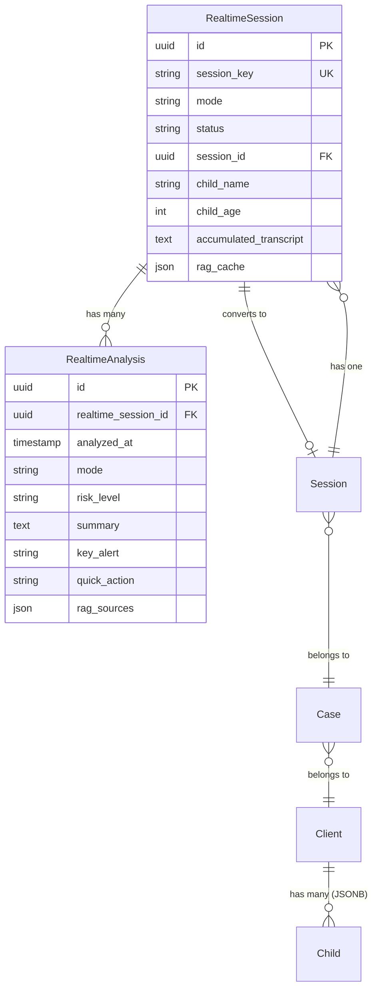
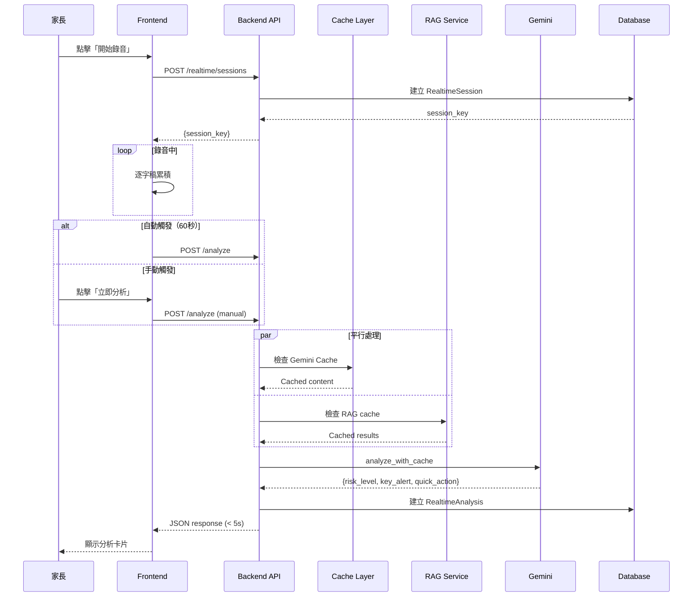
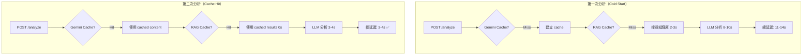
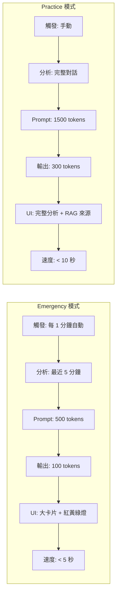
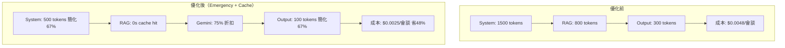
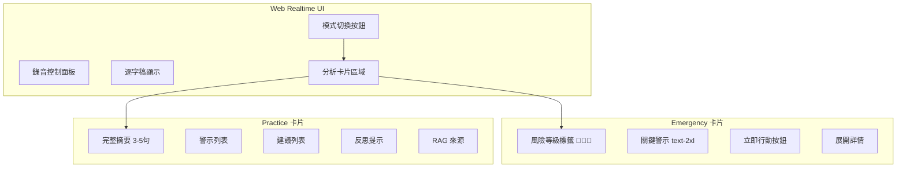
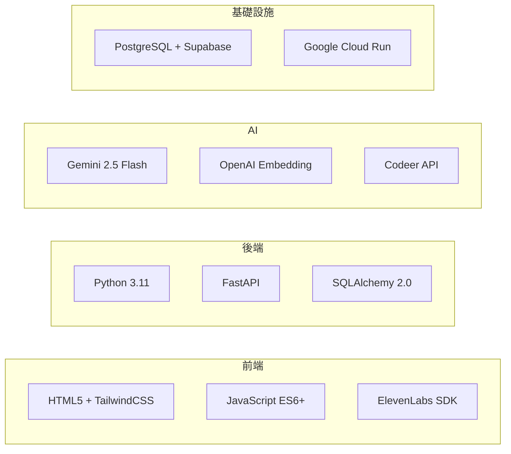
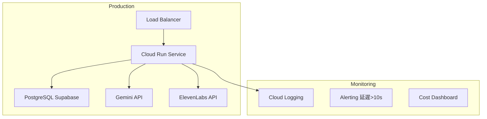

# TODO - Week of 2025-12-13

基於 2025-12-13 產品會議討論，本週待辦事項規劃。

---

## 🎯 本週優先目標

### 1. 完成親子即時諮詢 V2 架構規劃 ✅
**狀態**: 已完成（2025-12-13）
**交付文檔**:
- [x] 完整技術規格（58KB）- `docs/TECH_SPEC_PARENTING_REALTIME_V2.md`
- [x] 快速參考摘要（9.9KB）- `docs/TECH_SPEC_PARENTING_REALTIME_V2_SUMMARY.md`
- [x] 架構圖集（11KB，9 個 Mermaid 圖）- `docs/ARCHITECTURE_PARENTING_REALTIME_V2.md`
- [x] 文檔索引（6.7KB）- `docs/PARENTING_REALTIME_V2_INDEX.md`

**核心決策**:
- ✅ 雙模式設計：Emergency (< 5s) + Practice (< 10s)
- ✅ API 路徑分離：即時分析 vs 錄音歸檔
- ✅ 資料模型：RealtimeSession + RealtimeAnalysis
- ✅ 速度優化：11-14s → < 5s（64% 提升）
- ✅ 成本優化：省 48%（Emergency prompt 簡化）

### 2. 修復 RAG Threshold 問題 ✅
**狀態**: 已完成（2025-12-13）
**問題**: similarity_threshold=0.7 太高，導致 RAG 無法檢索相關知識
**解決**: 降至 0.5（基於生產數據分析，實際相似度最高 ~0.54-0.59）
**Commit**: `e81aa4c` - fix: lower RAG similarity threshold from 0.7 to 0.5

**已更新**:
- [x] `app/api/realtime.py` - 降低 threshold + 添加文檔註解
- [x] `tests/integration/test_realtime_rag_integration.py` - 更新測試斷言
- [x] `CHANGELOG.md` + `CHANGELOG_zh-TW.md` - 記錄修復

### 3. 擴充 RAG 關鍵字列表 ✅
**狀態**: 已完成（2025-12-13）
**成果**: 從 24 個關鍵字擴充至 78 個
**分類**:
- 基本詞彙（13）：親子、孩子、小孩、教養、育兒、管教等
- 情緒相關（13）：生氣、憤怒、焦慮、擔心、壓力、哭泣等
- 行為問題（8）：打人、攻擊、發脾氣、叛逆、不聽話等
- 日常場景（8）：功課、作業、睡覺、刷牙、吃飯等
- 人際關係（8）：手足、兄弟、姊妹、朋友、同學等
- 教養概念（14）：鼓勵、讚美、處罰、獎勵、責任、界限等
- 發展相關（9）：發展、成長、獨立、自律、自信等
- 依附相關（5）：依附、安全感、信任、分離、連結

**影響**: 提高 RAG 觸發精準度，覆蓋更多實際使用場景

---

## 📋 本週剩餘任務（Week 50: 2025-12-13 ~ 2025-12-19）

### 🚀 立即開始：Realtime 模式切換與紅綠燈功能

#### 💎 核心需求（用戶要求，立即實作）
**優先級**: 🔴 P0（最高優先）
**預估時間**: 4-6 小時
**負責人**: Backend (Young)

**需求 1: 模式切換功能**
- [ ] **事前練習模式（Practice）**
  - 卡片資訊：像現在一樣多（完整的 summary + alerts + suggestions）
  - 提供詳細分析、理論引用、反思提示
  - 目標：學習與成長

- [ ] **事中實戰模式（Emergency）**
  - 卡片資訊：極簡化，兩句話以內
  - 格式：一個大標題心法 + 一個實作操作
  - 目標：快速可執行、不打斷對話

**需求 2: Prompt 分離重構**
- [ ] 分離 Emergency prompt（簡化版，500 tokens）
- [ ] 分離 Practice prompt（完整版，1500 tokens）
- [ ] 設計不同的輸出格式（Emergency vs Practice）

**需求 3: 紅黃綠燈風險指示**
- [ ] 🔴 **紅燈（高危險）**
  - 偵測條件：家長情緒失控、暴力傾向、極端語言
  - 顯示：醒目紅色卡片、緊急建議

- [ ] 💛 **黃燈（有點危險）**
  - 偵測條件：情緒升高、衝突加劇、不當語氣
  - 顯示：黃色卡片、注意提醒

- [ ] 💚 **綠燈（安全/做得好）**
  - 偵測條件：溫和溝通、正向互動、有效策略
  - 顯示：綠色卡片、鼓勵與肯定

**實作步驟**（TDD）:
1. [ ] 更新 `app/schemas/realtime.py` - 新增 `mode` 和 `risk_level` 欄位
2. [ ] 更新 `app/api/realtime.py` - 支援模式切換
3. [ ] 實作風險評估邏輯（prompt engineering）
4. [ ] 更新前端 UI（模式切換按鈕 + 紅黃綠燈顯示）
5. [ ] 撰寫 integration tests
6. [ ] 更新文檔與範例

**Deliverable**:
- Mode 切換功能完成
- 紅黃綠燈風險指示正常運作
- Emergency 卡片極簡化（≤ 2 句話）

---

### Phase 1: 資料模型與 API 基礎（本週）

#### A. 資料庫設計與 Migration
**優先級**: 🟡 P1（模式切換完成後）
**預估時間**: 4-6 小時
**負責人**: Backend (Young)

- [ ] **建立資料模型**
  - [ ] `RealtimeSession` model（SQLAlchemy）
    - session_key, mode, status, child_name, child_age
    - accumulated_transcript, gemini_cache_name, rag_cache
  - [ ] `RealtimeAnalysis` model（SQLAlchemy）
    - mode, trigger_type, risk_level, summary, alerts, suggestions
    - key_alert, quick_action (Emergency), reflection_prompt (Practice)
  - [ ] 定義外鍵關係（FK to RealtimeSession）

- [ ] **資料庫 Migration**
  - [ ] 建立 Alembic migration script
  - [ ] 在 Dev 環境測試 migration
  - [ ] 驗證資料表結構與索引

- [ ] **Schema 定義**
  - [ ] Pydantic schemas（Request/Response models）
  - [ ] 驗證規則（mode enum, risk_level enum）

**Deliverable**: Migration script + Models + Schemas 完成

---

#### B. API Endpoints 開發（TDD）
**優先級**: 🔴 P0（本週必須完成）
**預估時間**: 6-8 小時
**負責人**: Backend (Young)

**1. 建立 Session API**
```
POST /api/v1/realtime/sessions
```
- [ ] 寫測試（TDD）：`test_create_realtime_session`
- [ ] 實作 API endpoint
- [ ] 驗證測試通過
- [ ] 文檔更新

**2. 更新即時分析 API**
```
POST /api/v1/realtime/analyze (已存在，需更新)
```
- [ ] 寫測試：`test_analyze_emergency_mode`, `test_analyze_practice_mode`
- [ ] 添加 `mode` 參數支援（emergency/practice）
- [ ] 實作不同模式的 prompt 差異
- [ ] 驗證測試通過
- [ ] 更新 API 文檔

**3. 取得分析歷史 API**
```
GET /api/v1/realtime/sessions/{session_key}/analyses
```
- [ ] 寫測試：`test_get_analysis_history`
- [ ] 實作 API endpoint
- [ ] 支援分頁（limit, offset）
- [ ] 驗證測試通過

**Deliverable**: 3 個 API endpoints 完成 + 10+ integration tests 通過

---

#### C. 速度與成本優化實驗
**優先級**: 🟡 P1（本週開始，下週完成）
**預估時間**: 4-6 小時
**負責人**: Backend (Young)

**1. RAG Session Cache**
- [ ] 實作 RAG 結果 cache（同一 session 不重複搜尋）
- [ ] 測試 cache hit/miss 效果
- [ ] 記錄性能數據（延遲改善）

**2. Emergency Prompt 簡化**
- [ ] 設計簡化版 system prompt（1500 → 500 tokens）
- [ ] 設計簡化版 output format（300 → 100 tokens）
- [ ] A/B 測試：品質 vs 速度 vs 成本

**3. 平行化處理**
- [ ] 實驗：RAG embedding + LLM 平行執行
- [ ] 測試延遲改善幅度
- [ ] 記錄實驗結果

**Deliverable**: 實驗報告 + 性能數據對比

---

### Phase 2: 前端整合（下週開始）

#### D. Web Realtime UI 更新（與 Hannah 協作）
**優先級**: 🟡 P1（下週）
**預估時間**: 6-8 小時
**負責人**: Frontend (Hannah) + Backend (Young)

**Backend 需提供**:
- [ ] API Response 格式範例（Emergency + Practice）
- [ ] WebSocket/Polling 建議
- [ ] 錯誤處理指南
- [ ] 卡片資料結構定義

**Frontend 需完成**:
- [ ] Emergency 模式大卡片 UI
- [ ] Practice 模式完整分析 UI
- [ ] 卡片互動（滑動、展開、歷史檢視）
- [ ] 紅黃綠燈危機提示視覺化

**整合測試**:
- [ ] E2E 測試：錄音 → 分析 → 顯示卡片
- [ ] 測試不同模式切換
- [ ] 測試卡片互動流程

---

### Phase 3: 孩子資料管理（下下週）

#### E. Client Management 整合
**優先級**: 🟢 P2（第三週）
**預估時間**: 4-6 小時

- [ ] Onboarding 流程設計
- [ ] 孩子資料 CRUD API
- [ ] Prompt 個人化（基於孩子年齡）
- [ ] 前端整合

---

## 🧪 測試計劃

### Integration Tests（本週完成）
**目標**: 10+ tests 通過

- [ ] `test_create_realtime_session` - 建立 session
- [ ] `test_analyze_emergency_mode` - Emergency 模式分析
- [ ] `test_analyze_practice_mode` - Practice 模式分析
- [ ] `test_analyze_with_cache` - Cache hit 驗證
- [ ] `test_get_analysis_history` - 取得歷史記錄
- [ ] `test_rag_session_cache` - RAG cache 驗證
- [ ] `test_emergency_mode_response_format` - 回應格式驗證
- [ ] `test_practice_mode_response_format` - 回應格式驗證
- [ ] `test_mode_parameter_validation` - 參數驗證
- [ ] `test_error_handling` - 錯誤處理

### Performance Tests（下週完成）
**目標**: Emergency < 5s, Practice < 10s

- [ ] `test_emergency_mode_latency` - Emergency 延遲測試
- [ ] `test_practice_mode_latency` - Practice 延遲測試
- [ ] `test_concurrent_sessions` - 並發 10 sessions 測試
- [ ] `test_cache_performance_improvement` - Cache 性能提升驗證

---

## 📊 本週目標 KPI

### 開發進度
- ✅ 技術規劃完成（4 份文檔，86KB）
- 🎯 資料模型建立（2 models）
- 🎯 API 開發（3 endpoints）
- 🎯 Integration Tests（10+ tests）

### 性能目標
- 🎯 Emergency 模式延遲：< 5 秒
- 🎯 RAG cache hit rate：> 50%
- 🎯 成本優化：48% 節省（Emergency prompt）

### 品質目標
- 🎯 Test coverage：> 80%（新代碼）
- 🎯 Ruff check：0 errors
- 🎯 Integration tests：100% 通過

---

## 🔄 下週預覽（Week 51: 2025-12-20 ~ 2025-12-26）

### Phase 2: 前端整合（主要）
- 完成 Emergency 模式大卡片 UI
- 完成 Practice 模式分析 UI
- 前後端整合測試
- E2E 測試流程

### Phase 3: 孩子資料管理（開始）
- Onboarding 流程設計
- 孩子資料 API 開發

### 優化與測試
- 性能測試（延遲、並發）
- 成本測試（token 使用量）
- 壓力測試（高負載）

---

## 📐 親子即時諮詢 V2 - 完整技術規格

<details>
<summary><strong>點擊展開：核心設計決策</strong></summary>

### 1. 產品定位：雙模式設計

#### 🚨 事中急救模式（Emergency Mode）
**使用場景**: 家長正在面對親子衝突，需要立即協助

**核心特性**:
- **即時分析**: 每 1 分鐘自動觸發
- **手動分析**: 緊急時刻點擊按鈕立即分析
- **紅黃綠燈危機提示**: 視覺化風險等級
- **大卡片 UI**: 大字體、低資訊密度、易讀取
- **簡短建議**: 每條建議 < 50 字，快速可執行

**速度要求**: < 5 秒（目前十幾秒需優化）

**回應格式**（簡化版）:
```json
{
  "risk_level": "red|yellow|green",
  "summary": "案主處境簡述（1-2 句）",
  "key_alert": "最重要的一件事（< 30 字）",
  "quick_action": "立即可做的事（< 50 字）",
  "details": {
    "alerts": ["...", "..."],
    "suggestions": ["...", "..."]
  }
}
```

#### 🎓 事前練習模式（Practice Mode）
**使用場景**: 家長想學習親子溝通技巧，模擬練習

**核心特性**:
- **深度分析**: 完整的摘要、警示、建議
- **反思互動**: 類似 SpeakAI 的對話式學習
- **理論引用**: 顯示 RAG 來源（正向教養、情緒教養等）
- **歷史檢視**: 可回顧過往練習記錄

**速度要求**: < 10 秒（可接受較慢，品質優先）

### 2. API 路徑分離策略

#### 🔄 路徑 A：即時分析 API（Partial/Streaming）
```
POST /api/v1/realtime/analyze
```
**職責**: 接收累積的 transcript、快速返回分析結果、支援模式切換
**特點**: 無需登入、無資料庫寫入、Session ID 用於 cache key

#### 💾 路徑 B：錄音歸檔 API（Final/Storage）
```
POST /api/v1/sessions/{session_id}/recordings
```
**職責**: 會談結束後保存完整錄音、與 Session/Client/Case 建立關聯
**特點**: 需要登入、資料庫寫入、多租戶隔離

### 3. 速度與成本優化

| 優化項目 | 當前耗時 | 優化後 | 方法 |
|---------|---------|--------|------|
| RAG 搜尋 | 2-3s | 0.5s | Session-level cache |
| LLM 回應 | 8-10s | 3-4s | Gemini Cache + 簡化 prompt |
| 前端渲染 | 1s | 0.5s | 卡片預載 + 骨架屏 |
| **總延遲** | **11-14s** | **< 5s** | - |

**成本優化**: $0.0048 → $0.0025/會談（省 48%）

</details>

<details>
<summary><strong>點擊展開：API 完整規格</strong></summary>

### API 1: 建立 Realtime Session

```yaml
POST /api/v1/realtime/sessions

Request Body:
  mode: string (required)  # "emergency" or "practice"
  child_name: string (optional)
  child_age: integer (optional)
  child_grade: string (optional)

Response 200:
  session_key: string  # UUID
  mode: string
  child_info: object | null
  started_at: string (ISO 8601)
```

**範例 Request**:
```json
{
  "mode": "emergency",
  "child_name": "小明",
  "child_age": 7,
  "child_grade": "小學二年級"
}
```

### API 2: 即時分析（已存在，需更新）

```yaml
POST /api/v1/realtime/analyze

Request Body:
  mode: string (required)  # "emergency" or "practice"
  session_key: string (required)
  transcript: string (required)
  speakers: array[object] (required)
  time_range: string (optional)
  trigger_type: string (optional)  # "auto" or "manual"
  use_cache: boolean (optional)  # Default: true

Response 200:
  mode: string
  risk_level: string | null  # Emergency only
  summary: string
  key_alert: string | null  # Emergency only
  quick_action: string | null  # Emergency only
  details: object | null
  reflection_prompt: string | null  # Practice only
  rag_sources: array[RAGSource]
  provider_metadata: ProviderMetadata
```

**範例 Request (Emergency)**:
```json
{
  "mode": "emergency",
  "session_key": "550e8400-e29b-41d4-a716-446655440000",
  "transcript": "家長：小明！你怎麼還不去睡覺！\n小明：我不要！",
  "speakers": [
    {"speaker": "parent", "text": "小明！你怎麼還不去睡覺！"},
    {"speaker": "child", "text": "我不要！"}
  ],
  "trigger_type": "manual"
}
```

**範例 Response (Emergency)**:
```json
{
  "mode": "emergency",
  "risk_level": "yellow",
  "summary": "孩子拒絕睡覺，家長情緒升高",
  "key_alert": "注意：家長威脅語氣，情緒接近臨界點",
  "quick_action": "深呼吸 3 次，用平靜語氣說「我數到 3」",
  "details": {
    "alerts": ["💛 理解家長疲憊感", "⚠️ 威脅語氣可能加劇衝突"],
    "suggestions": ["💡 先處理自己情緒", "💡 給孩子選擇權"]
  },
  "provider_metadata": {
    "provider": "gemini",
    "latency_ms": 4200
  }
}
```

### API 3: 取得分析歷史

```yaml
GET /api/v1/realtime/sessions/{session_key}/analyses

Query Parameters:
  limit: integer (optional, default: 20)
  offset: integer (optional, default: 0)

Response 200:
  total: integer
  analyses: array[RealtimeAnalysis]
```

### API 4: 錄音歸檔

```yaml
POST /api/v1/sessions/{session_id}/recordings

Authentication: Required (JWT)

Request Body:
  realtime_session_key: string (required)
  final_transcript: string (required)
  speakers: array[object] (required)
  duration_seconds: integer (required)
  save_analyses: boolean (optional, default: true)

Response 200:
  session_id: string
  recordings_saved: integer
  analyses_archived: integer
  realtime_session_completed: boolean
```

</details>

<details>
<summary><strong>點擊展開：資料模型詳細定義</strong></summary>

### RealtimeSession Model

```python
class RealtimeSession(Base, BaseModel):
    """即時諮詢 Session（Web Realtime 專用）"""
    __tablename__ = "realtime_sessions"

    # Core fields
    session_key = Column(String, unique=True, nullable=False, index=True)
    mode = Column(String(20), nullable=False, default="emergency")
    status = Column(String(20), nullable=False, default="active")

    # 關聯至正式 Session（可選）
    session_id = Column(GUID(), ForeignKey("sessions.id"), nullable=True)

    # Multi-tenant
    tenant_id = Column(String, nullable=True, index=True)
    counselor_id = Column(GUID(), ForeignKey("counselors.id"), nullable=True)

    # 孩子資料（可選）
    child_name = Column(String(100), nullable=True)
    child_age = Column(Integer, nullable=True)
    child_grade = Column(String(50), nullable=True)

    # Transcript 累積
    accumulated_transcript = Column(String, default="")
    speakers = Column(JSON, default=list)

    # Session metadata
    started_at = Column(DateTime(timezone=True), default=datetime.utcnow)
    last_analyzed_at = Column(DateTime(timezone=True), nullable=True)
    completed_at = Column(DateTime(timezone=True), nullable=True)
    duration_seconds = Column(Integer, default=0)

    # Cache 管理
    gemini_cache_name = Column(String, nullable=True)
    cache_last_updated_at = Column(DateTime(timezone=True), nullable=True)

    # RAG cache（避免重複搜尋）
    rag_cache = Column(JSON, default=dict)

    # Relationships
    session = relationship("Session", back_populates="realtime_session")
    analyses = relationship("RealtimeAnalysis", back_populates="realtime_session")
```

### RealtimeAnalysis Model

```python
class RealtimeAnalysis(Base, BaseModel):
    """即時分析記錄（每次分析產生一筆）"""
    __tablename__ = "realtime_analyses"

    # 關聯至 RealtimeSession
    realtime_session_id = Column(GUID(), ForeignKey("realtime_sessions.id"), nullable=False)

    # Analysis metadata
    analyzed_at = Column(DateTime(timezone=True), default=datetime.utcnow)
    mode = Column(String(20), nullable=False)
    trigger_type = Column(String(20), nullable=False)
    time_range = Column(String(50), nullable=True)

    # 被分析的 transcript 片段（快照）
    transcript_snapshot = Column(Text, nullable=False)

    # Analysis results
    risk_level = Column(String(10), nullable=True)  # red/yellow/green
    summary = Column(Text, nullable=False)
    alerts = Column(JSON, default=list)
    suggestions = Column(JSON, default=list)

    # Emergency 模式專用欄位
    key_alert = Column(String(100), nullable=True)
    quick_action = Column(String(200), nullable=True)

    # Practice 模式專用欄位
    reflection_prompt = Column(Text, nullable=True)

    # RAG 來源
    rag_sources = Column(JSON, default=list)

    # Performance metadata
    provider = Column(String(20), nullable=False)
    model = Column(String(50), nullable=True)
    latency_ms = Column(Integer, nullable=True)

    # Cache metadata
    cache_hit = Column(JSON, default=dict)

    # Relationships
    realtime_session = relationship("RealtimeSession", back_populates="analyses")
```

### Client Model 擴展

```python
# app/models/client.py (新增欄位)
class Client(Base, BaseModel):
    # ... 現有欄位 ...

    # 新增：孩子資料（JSONB 儲存多個孩子）
    children = Column(JSON, default=list)
    # [
    #   {
    #     "name": "小明",
    #     "age": 7,
    #     "grade": "小學二年級",
    #     "birth_date": "2018-05-20",
    #     "notes": "容易生氣、拒絕寫作業"
    #   }
    # ]
```

</details>

<details>
<summary><strong>點擊展開：架構圖（9 個 Mermaid 圖表）</strong></summary>

### 1. 系統架構總覽

```mermaid
graph TB
    subgraph "前端層"
        A[家長] --> B[Web Realtime UI]
        B --> C[ElevenLabs Scribe]
        B --> D[模式切換]
    end

    subgraph "API 層"
        E[POST /realtime/sessions]
        F[POST /realtime/analyze]
        G[GET /sessions/{key}/analyses]
    end

    subgraph "服務層"
        H[RealtimeSessionService]
        I[RealtimeAnalysisService]
        J[RAGCacheService]
    end

    subgraph "AI 層"
        K[Gemini Service]
        L[Codeer Service]
        M[RAG Service]
    end

    subgraph "資料層"
        N[(PostgreSQL)]
        O[RealtimeSession]
        P[RealtimeAnalysis]
    end

    B --> E
    B --> F
    D --> F
    E --> H
    F --> I
    H --> N
    I --> J
    I --> K
    J --> M
```

### 2. 資料模型關係圖



### 3. 即時分析流程圖（Emergency 模式）



### 4. Cache 優化策略圖



### 5. 模式差異對比圖



### 6. 成本優化對比圖



### 7. 前端 UI 架構圖



### 8. 技術棧總覽



### 9. 部署架構圖



</details>

<details>
<summary><strong>點擊展開：前端整合要點</strong></summary>

### 自動分析觸發

```javascript
// 每 1 分鐘自動觸發分析
let analysisTimer;
let lastAnalysisTime = 0;
const ANALYSIS_INTERVAL = 60000;  // 60 秒

elevenLabsWs.onmessage = (event) => {
  accumulatedTranscript += event.data;

  // 自動觸發邏輯
  if (Date.now() - lastAnalysisTime > ANALYSIS_INTERVAL) {
    triggerAnalysis('auto');
    lastAnalysisTime = Date.now();
  }
};

// 手動觸發
analyzeButton.addEventListener('click', () => {
  triggerAnalysis('manual');
});
```

### Emergency 卡片 UI 範例

```html
<div class="analysis-card card-emergency" data-risk="yellow">
  <div class="card-header bg-yellow-500">
    <span class="text-3xl">💛</span>
    <span class="text-xl font-bold">注意</span>
  </div>

  <div class="card-body">
    <!-- 關鍵訊息（大字體） -->
    <div class="key-alert text-2xl font-bold">
      家長提到「快氣死了」，情緒接近臨界點
    </div>

    <!-- 立即行動 -->
    <div class="quick-action bg-blue-100 p-6 rounded-lg">
      <div class="text-xl">深呼吸 3 次，離開現場 2 分鐘</div>
    </div>

    <!-- 展開詳情按鈕 -->
    <button class="expand-btn">查看詳細建議 ▼</button>
  </div>

  <!-- 詳情（預設隱藏） -->
  <div class="card-details hidden">
    <!-- alerts + suggestions -->
  </div>
</div>
```

### 卡片互動行為

```javascript
// 卡片滑動（新卡片從右側滑入）
function addNewCard(analysisData) {
  const card = createCardElement(analysisData);
  card.classList.add('animate-slide-in-right');

  // 舊卡片縮小並向左移
  if (cardHistory.length > 0) {
    cardHistory[0].classList.add('card-shrink-left');
  }

  // 保存至歷史（最多顯示 3 張）
  cardHistory.unshift(card);
  if (cardHistory.length > 3) {
    cardHistory.pop().remove();
  }

  container.prepend(card);
}

// 展開/收合詳情
card.querySelector('.expand-btn').addEventListener('click', () => {
  const details = card.querySelector('.card-details');
  details.classList.toggle('hidden');
});
```

</details>

<details>
<summary><strong>點擊展開：Migration Plan</strong></summary>

### 向後相容策略

**方案: 參數相容**（採用此方案）

```python
# 更新現有 endpoint，透過參數判斷版本
@router.post("/analyze")
async def analyze_transcript(
    request: RealtimeAnalyzeRequest,
    # 新參數（選填，預設值保持舊行為）
    mode: str = "practice",
    session_key: str = "",
):
    """統一 endpoint（新舊共存）"""

    if session_key:
        # 新版行為：使用 session 管理
        session = get_realtime_session(session_key)
        # ...
    else:
        # 舊版行為：無 session，直接分析
        # ...
```

### 資料遷移步驟

#### Step 1: 資料庫 Migration

```bash
# 1. 建立 migration script
poetry run alembic revision --autogenerate -m "Add realtime session models"

# 2. 執行 migration（先在 dev 環境）
poetry run alembic upgrade head

# 3. 驗證 tables 建立成功
psql $DATABASE_URL -c "\dt realtime*"
```

#### Step 2: 更新 API（漸進式）

- Week 1: 新增 models + services（不影響現有 API）
- Week 2: 更新 /analyze endpoint（向後相容）
- Week 3: 新增 /sessions 和 /analyses endpoints
- Week 4: 前端整合 + 測試

#### Step 3: 前端適配

```javascript
// 前端同時支援 v1 和 v2 API（Feature Flag）
const USE_V2_API = process.env.ENABLE_REALTIME_V2 === 'true';

async function analyzeTranscript(transcript) {
  if (USE_V2_API) {
    // 新版：先建立 session
    const session = await createRealtimeSession({ mode: 'emergency' });
    return await analyzeWithSession(session.session_key, transcript);
  } else {
    // 舊版：直接分析
    return await analyzeV1(transcript);
  }
}
```

</details>

<details>
<summary><strong>點擊展開：實作時間表（10 週）</strong></summary>

### Phase 1: 基礎建設（Week 1-2）

| 任務 | 預估時間 | 狀態 |
|------|---------|------|
| 建立 RealtimeSession + RealtimeAnalysis models | 4h | 🟡 Planning |
| 資料庫 migration script + 測試 | 2h | 🟡 Planning |
| RealtimeSessionService（CRUD） | 4h | 🟡 Planning |
| RAGCacheService（session-level cache） | 3h | 🟡 Planning |
| TranscriptManager（sliding window） | 2h | 🟡 Planning |
| Integration tests（models + services） | 4h | 🟡 Planning |

**Milestone**: 資料模型和基礎服務建立完成

### Phase 2: API 開發（Week 3-4）

| 任務 | 預估時間 | 狀態 |
|------|---------|------|
| POST /realtime/sessions（建立 session） | 3h | 🟡 Planning |
| 更新 POST /realtime/analyze（模式切換） | 6h | 🟡 Planning |
| GET /realtime/sessions/{key}/analyses | 2h | 🟡 Planning |
| POST /sessions/{id}/recordings（歸檔） | 4h | 🟡 Planning |
| Emergency 模式 prompt 簡化 | 2h | 🟡 Planning |
| 平行化處理（RAG + Cache） | 3h | 🟡 Planning |
| API integration tests（TDD） | 6h | 🟡 Planning |

**Milestone**: API 開發完成，可供前端整合

### Phase 3: 速度與成本優化（Week 5）

| 任務 | 預估時間 | 狀態 |
|------|---------|------|
| RAG session cache 實作 | 3h | 🟡 Planning |
| Gemini Cache 優化（emergency prompt） | 2h | 🟡 Planning |
| 延遲測試（目標 < 5s） | 2h | 🟡 Planning |
| 成本分析（每場會談成本） | 2h | 🟡 Planning |
| 參數調優（threshold, cache TTL） | 3h | 🟡 Planning |

**Milestone**: 延遲 < 5s，成本 < $0.003/會談

### Phase 4: 前端整合（Week 6-7）

| 任務 | 預估時間 | 負責人 | 狀態 |
|------|---------|--------|------|
| Session 管理（建立/更新/完成） | 4h | Frontend | 🟡 Planning |
| Emergency 模式 UI（大卡片） | 6h | Frontend | 🟡 Planning |
| Practice 模式 UI（完整版） | 4h | Frontend | 🟡 Planning |
| 卡片互動（滑動/展開/歷史） | 5h | Frontend | 🟡 Planning |
| 自動分析（每 1 分鐘） | 3h | Frontend | 🟡 Planning |
| 手動分析按鈕 | 2h | Frontend | 🟡 Planning |
| 錄音歸檔流程 | 3h | Frontend | 🟡 Planning |

**Milestone**: Web Realtime 前端整合完成

### Phase 5: 孩子資料管理（Week 8）

| 任務 | 預估時間 | 狀態 |
|------|---------|------|
| Client model 擴展（children 欄位） | 2h | 🟡 Planning |
| Onboarding 孩子資料表單 | 4h | 🟡 Planning |
| Prompt 中使用孩子資料 | 3h | 🟡 Planning |
| 多孩子管理 UI | 4h | 🟡 Planning |
| 孩子資料整合測試 | 2h | 🟡 Planning |

**Milestone**: 孩子資料管理功能上線

### Phase 6: 測試與上線（Week 9-10）

| 任務 | 預估時間 | 狀態 |
|------|---------|------|
| E2E 測試（完整流程） | 6h | 🟡 Planning |
| 壓力測試（並發 10 sessions） | 3h | 🟡 Planning |
| API 文檔更新 | 2h | 🟡 Planning |
| 使用者指南（前端） | 3h | 🟡 Planning |
| Staging 部署 + 驗證 | 2h | 🟡 Planning |
| Production 部署 | 2h | 🟡 Planning |
| 設定 alerting（延遲 > 10s） | 2h | 🟡 Planning |

**Milestone**: MVP 上線，開始收集使用者反饋

</details>

---

## 📝 Notes & Decisions

### 技術決策記錄
1. **API 路徑分離** (2025-12-13)
   - 決策：分離「即時分析」與「錄音歸檔」兩條 API 路徑
   - 理由：避免 segment 與 recording 的對應混亂，簡化資料模型
   - 影響：需要建立新的 RealtimeSession/RealtimeAnalysis models

2. **雙模式設計** (2025-12-13)
   - 決策：Emergency (急救) + Practice (練習) 雙模式
   - 理由：符合產品定位（事中急救 vs 事前練習）
   - 影響：需要不同的 prompt、UI、回應格式

3. **RAG Threshold 調整** (2025-12-13)
   - 決策：降低 similarity_threshold 從 0.7 至 0.5
   - 理由：實際相似度分數最高約 0.54-0.59，0.7 太嚴格
   - 影響：提高 RAG 召回率，但可能降低精確度

### 產品會議重點
- **使用者體驗**：手機端卡片要大、字要大、資訊密度要低
- **互動設計**：紅黃綠燈危機提示、卡片滑動/展開/歷史檢視
- **倫理考量**：錄音權限、家長向孩子說明使用目的
- **速度要求**：< 5 秒（Emergency）、< 10 秒（Practice）

### 待討論事項
- [ ] 卡片疊加/覆蓋規則（新卡片如何顯示？）
- [ ] 歷史卡片快速回看機制
- [ ] RAG cache 失效策略（多久過期？）
- [ ] 錄音片段如何對應歷史卡片？

---

## ✅ 完成檢查清單（本週）

### 必須完成（P0）
- [ ] RealtimeSession + RealtimeAnalysis models
- [ ] 資料庫 migration (dev)
- [ ] POST /api/v1/realtime/sessions
- [ ] POST /api/v1/realtime/analyze（更新支援 mode）
- [ ] GET /api/v1/realtime/sessions/{session_key}/analyses
- [ ] 10+ integration tests 通過
- [ ] API 文檔更新

### 建議完成（P1）
- [ ] RAG session cache 實作
- [ ] Emergency prompt 簡化實驗
- [ ] 性能測試數據收集
- [ ] 前端整合準備（API 範例、文檔）

### 可選完成（P2）
- [ ] 平行化處理實驗
- [ ] A/B 測試框架
- [ ] 監控儀表板設計

---

**版本**: Week 50 (2025-12-13)
**最後更新**: 2025-12-13 23:00
**下次更新**: 2025-12-20（下週檢討會議後）
