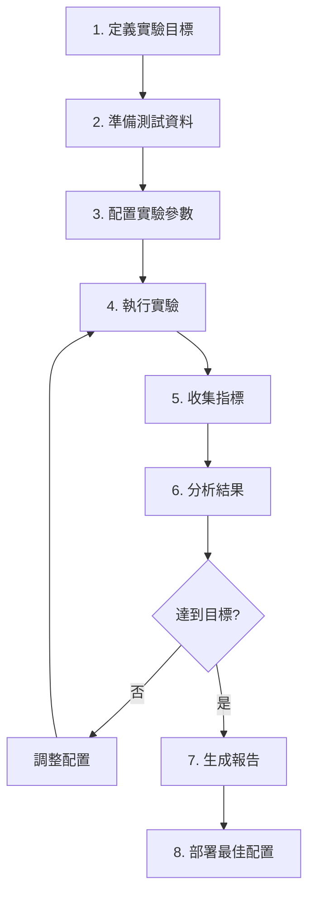

# 專家分身評估與優化框架
# Expert Avatar Evaluation & Optimization Framework

> **目標**：建立系統性評估框架，針對「專家分身」的 4 個核心變數進行實驗與優化，並兼顧品質、穩定性、可靠性與成本。

---

## **目錄**

1. [核心變數定義](#核心變數定義)
2. [評估指標體系](#評估指標體系)
3. [實驗框架設計](#實驗框架設計)
4. [成本與效能監控](#成本與效能監控)
5. [實作架構](#實作架構)
6. [實驗流程](#實驗流程)
7. [決策樹](#決策樹)

---

## **核心變數定義**

### **1. 文件品質（Document Quality）**

#### **定義維度：**
- **內容準確性**：資訊是否正確、最新
- **結構完整性**：是否有完整的段落結構
- **專業深度**：是否涵蓋專家級見解
- **可讀性**：文字是否清晰易懂

#### **量化指標：**
```python
DocumentQuality = {
    "content_accuracy": float,      # 0-1，透過專家驗證或對照標準答案
    "structural_score": float,      # 0-1，段落結構、標題層級完整度
    "expertise_depth": float,       # 0-1，專業術語密度、深度指標
    "readability_score": float,     # 0-100，Flesch Reading Ease
    "metadata": {
        "pages": int,
        "word_count": int,
        "avg_sentence_length": float,
        "technical_terms_count": int
    }
}
```

#### **分級標準：**
| 等級 | 綜合分數 | 描述 |
|------|---------|------|
| **A** | 0.85-1.0 | 專家級，可直接使用 |
| **B** | 0.70-0.85 | 良好，需少量修正 |
| **C** | 0.50-0.70 | 可用，需較多改善 |
| **D** | < 0.50 | 不建議使用 |

---

### **2. Chunking 方法（Chunking Method）**

#### **支援方法：**
```python
ChunkingMethods = [
    "fixed",          # 固定大小切分
    "recursive",      # 遞歸切分（推薦 baseline）
    "semantic",       # 語義切分
    "parent_child",   # 父子切分
    "agentic",        # LLM 智能切分
    "adaptive"        # 自適應切分
]
```

#### **方法特性對照：**
| 方法 | 品質 | 速度 | 成本 | 穩定性 | 適用場景 |
|------|------|------|------|--------|----------|
| **Fixed** | ⭐⭐ | ⭐⭐⭐⭐⭐ | $ | ⭐⭐⭐⭐⭐ | 快速原型 |
| **Recursive** | ⭐⭐⭐⭐ | ⭐⭐⭐⭐ | $ | ⭐⭐⭐⭐⭐ | 通用推薦 |
| **Semantic** | ⭐⭐⭐⭐ | ⭐⭐⭐ | $$ | ⭐⭐⭐⭐ | 主題明確文檔 |
| **Parent-Child** | ⭐⭐⭐⭐⭐ | ⭐⭐⭐ | $$ | ⭐⭐⭐⭐ | 長文檔 |
| **Agentic** | ⭐⭐⭐⭐⭐ | ⭐⭐ | $$$ | ⭐⭐⭐ | 複雜結構 |
| **Adaptive** | ⭐⭐⭐⭐⭐ | ⭐⭐ | $$$ | ⭐⭐⭐ | 多樣化內容 |

---

### **3. Chunking 參數（Chunking Parameters）**

#### **參數空間：**
```python
ChunkingParameters = {
    "chunk_size": [100, 200, 300, 400, 500, 600, 800, 1000],  # tokens/chars
    "overlap": [0, 20, 40, 60, 80, 100, 120],                  # tokens/chars
    "overlap_ratio": [0.0, 0.05, 0.10, 0.15, 0.20],           # percentage
    "min_chunk_size": int,                                     # minimum size
    "max_chunk_size": int,                                     # maximum size
}
```

#### **推薦配置（根據研究）：**
| 文檔類型 | chunk_size | overlap | overlap_ratio |
|---------|-----------|---------|---------------|
| **職涯諮詢報告** | 400 | 80 | 20% |
| **技術文檔** | 300 | 60 | 15% |
| **法律文件** | 500 | 50 | 10% |
| **對話紀錄** | 600 | 120 | 20% |

---

### **4. 文件廣度（Document Coverage）**

#### **定義維度：**
- **主題覆蓋度**：涵蓋專家領域的主題數量
- **知識深度**：每個主題的深度層級
- **更新頻率**：知識庫的更新週期
- **多樣性**：不同類型文檔的比例

#### **量化指標：**
```python
DocumentCoverage = {
    "topic_coverage": {
        "total_topics": int,              # 總主題數
        "covered_topics": int,            # 已涵蓋主題數
        "coverage_ratio": float,          # 覆蓋率 0-1
        "topic_distribution": dict        # 各主題文檔數量分布
    },
    "knowledge_depth": {
        "avg_depth_level": float,         # 平均深度層級
        "max_depth_level": int,           # 最大深度
        "depth_distribution": dict        # 深度分布
    },
    "diversity": {
        "document_types": list,           # 文檔類型列表
        "type_distribution": dict,        # 類型分布
        "shannon_entropy": float          # 多樣性熵值
    },
    "freshness": {
        "avg_age_days": float,            # 平均文檔年齡
        "oldest_doc_age": int,            # 最舊文檔年齡
        "newest_doc_age": int,            # 最新文檔年齡
        "update_frequency": float         # 更新頻率（docs/month）
    }
}
```

#### **廣度等級：**
| 等級 | 主題覆蓋率 | 文檔數量 | 描述 |
|------|-----------|---------|------|
| **初級** | < 30% | < 10 | 基礎知識 |
| **中級** | 30-60% | 10-30 | 常見主題 |
| **高級** | 60-85% | 30-100 | 專業完整 |
| **專家級** | > 85% | > 100 | 全面覆蓋 |

---

## **評估指標體系**

### **1. 品質指標（Quality Metrics）**

#### **A. 檢索品質（Retrieval Quality）**
```python
RetrievalQuality = {
    # 排序指標
    "MRR": float,                    # Mean Reciprocal Rank (0-1)
    "NDCG@k": float,                 # Normalized DCG at k (0-1)
    "MAP@k": float,                  # Mean Average Precision at k (0-1)

    # 召回指標
    "Recall@k": float,               # Recall at k (0-1)
    "Hit_Rate": float,               # Hit rate (0-1)

    # 精準度指標
    "Precision@k": float,            # Precision at k (0-1)

    # 目標：
    # - MRR > 0.75 (良好), > 0.85 (優秀)
    # - Recall@10 > 0.85 (良好), > 0.92 (優秀)
    # - NDCG@10 > 0.70 (良好), > 0.85 (優秀)
}
```

#### **B. 生成品質（Generation Quality）**
```python
GenerationQuality = {
    # 答案正確性
    "factual_correctness": float,    # 事實準確度 (0-1)
    "answer_relevance": float,       # 答案相關性 (0-1)
    "completeness": float,           # 完整度 (0-1)

    # 語言品質
    "fluency": float,                # 流暢度 (0-1)
    "coherence": float,              # 連貫性 (0-1)

    # 專家品質
    "expertise_level": float,        # 專業度 (0-1)
    "citation_accuracy": float,      # 引用準確度 (0-1)

    # 目標：
    # - factual_correctness > 0.90
    # - answer_relevance > 0.85
    # - expertise_level > 0.80
}
```

#### **C. 上下文品質（Context Quality）**
```python
ContextQuality = {
    "context_relevance": float,      # 上下文相關性 (0-1)
    "context_precision": float,      # 上下文精準度 (0-1)
    "context_recall": float,         # 上下文召回率 (0-1)
    "faithfulness": float,           # 忠實度 (0-1)

    # 目標：
    # - context_relevance > 0.80
    # - faithfulness > 0.90
}
```

---

### **2. 效能指標（Performance Metrics）**

```python
PerformanceMetrics = {
    # 延遲指標
    "retrieval_latency_p50": float,  # 檢索延遲中位數 (ms)
    "retrieval_latency_p95": float,  # 檢索延遲 95% (ms)
    "generation_latency_p50": float, # 生成延遲中位數 (ms)
    "generation_latency_p95": float, # 生成延遲 95% (ms)
    "e2e_latency_p50": float,        # 端到端延遲中位數 (ms)
    "e2e_latency_p95": float,        # 端到端延遲 95% (ms)

    # 吞吐量
    "queries_per_second": float,     # QPS
    "max_concurrent_users": int,     # 最大並發用戶

    # 目標：
    # - e2e_latency_p95 < 3000ms (可接受)
    # - e2e_latency_p95 < 2000ms (良好)
    # - e2e_latency_p95 < 1500ms (優秀)
}
```

---

### **3. 成本指標（Cost Metrics）**

```python
CostMetrics = {
    # 存儲成本
    "storage_cost_per_month": float,      # USD/month
    "storage_size_gb": float,             # GB
    "num_embeddings": int,                # embedding 數量
    "avg_embedding_size_kb": float,       # 平均 embedding 大小

    # API 成本
    "embedding_cost_per_1k": float,       # Embedding API 成本
    "llm_cost_per_1k_input": float,       # LLM input tokens 成本
    "llm_cost_per_1k_output": float,      # LLM output tokens 成本

    # 總成本
    "cost_per_query": float,              # 每次查詢成本
    "cost_per_user_per_month": float,     # 每用戶每月成本
    "total_cost_per_month": float,        # 總月成本

    # Token 使用
    "avg_input_tokens": float,            # 平均 input tokens
    "avg_output_tokens": float,           # 平均 output tokens
    "avg_context_tokens": float,          # 平均 context tokens

    # 目標：
    # - cost_per_query < $0.05 (經濟)
    # - cost_per_query < $0.02 (優秀)
}
```

---

### **4. 可靠性指標（Reliability Metrics）**

```python
ReliabilityMetrics = {
    # 可用性
    "uptime_percentage": float,           # 正常運行時間 %
    "error_rate": float,                  # 錯誤率
    "timeout_rate": float,                # 超時率

    # 一致性
    "response_consistency": float,        # 相同查詢的回應一致性
    "chunk_health_score": float,          # Chunk 健康度平均分

    # 穩定性
    "std_latency": float,                 # 延遲標準差
    "std_cost": float,                    # 成本標準差

    # 目標：
    # - uptime_percentage > 99.5%
    # - error_rate < 1%
    # - response_consistency > 0.85
}
```

---

## **實驗框架設計**

### **實驗配置結構**

```python
from dataclasses import dataclass
from typing import Literal, Optional
from datetime import datetime

@dataclass
class DocumentQualityConfig:
    """文件品質配置"""
    min_quality_score: float = 0.70
    min_readability: float = 60.0
    require_expert_validation: bool = False

@dataclass
class ChunkingConfig:
    """Chunking 配置"""
    method: Literal["fixed", "recursive", "semantic", "parent_child", "agentic", "adaptive"]
    chunk_size: int
    overlap: int
    overlap_ratio: Optional[float] = None
    split_by_sentence: bool = True
    preserve_words: bool = True

    # 方法特定配置
    semantic_similarity_threshold: Optional[float] = 0.85
    parent_chunk_size: Optional[int] = 1000
    child_chunk_size: Optional[int] = 200

@dataclass
class DocumentCoverageConfig:
    """文件廣度配置"""
    required_topics: list[str]
    min_docs_per_topic: int = 3
    max_doc_age_days: int = 365
    min_coverage_ratio: float = 0.60

@dataclass
class ExperimentConfig:
    """完整實驗配置"""
    experiment_id: str
    experiment_name: str
    created_at: datetime

    # 4 個核心變數
    document_quality: DocumentQualityConfig
    chunking: ChunkingConfig
    coverage: DocumentCoverageConfig

    # 評估配置
    test_queries: list[str]
    ground_truth: dict
    eval_metrics: list[str]

    # 約束條件
    max_cost_per_query: float = 0.05
    max_latency_p95: float = 3000.0
    min_quality_threshold: float = 0.75

    # 元數據
    tags: list[str]
    description: str
```

---

### **實驗矩陣設計（Design of Experiments）**

#### **全因子實驗（Full Factorial Design）**

```python
# 變數組合數
# 文件品質 (3 levels) × Chunking方法 (6 types) × Chunk參數 (8 sizes) × 文件廣度 (4 levels)
# = 3 × 6 × 8 × 4 = 576 種組合

# 過多！需要降維

# 推薦：分階段實驗
```

#### **階段 1：Chunking 方法比較（固定其他變數）**
```python
experiments_phase1 = [
    # 固定：中等品質文件 + 中等廣度
    ExperimentConfig(
        experiment_id="exp-001",
        chunking=ChunkingConfig(method="fixed", chunk_size=400, overlap=80),
        ...
    ),
    ExperimentConfig(
        experiment_id="exp-002",
        chunking=ChunkingConfig(method="recursive", chunk_size=400, overlap=80),
        ...
    ),
    ExperimentConfig(
        experiment_id="exp-003",
        chunking=ChunkingConfig(method="semantic", chunk_size=400, overlap=80),
        ...
    ),
    # ... 其他方法
]
```

#### **階段 2：參數調優（使用最佳方法）**
```python
# 假設 Phase 1 結果：recursive 最佳
experiments_phase2 = [
    ExperimentConfig(
        experiment_id="exp-101",
        chunking=ChunkingConfig(method="recursive", chunk_size=200, overlap=40),
        ...
    ),
    ExperimentConfig(
        experiment_id="exp-102",
        chunking=ChunkingConfig(method="recursive", chunk_size=400, overlap=80),
        ...
    ),
    ExperimentConfig(
        experiment_id="exp-103",
        chunking=ChunkingConfig(method="recursive", chunk_size=600, overlap=120),
        ...
    ),
]
```

#### **階段 3：文件品質影響**
```python
experiments_phase3 = [
    # 使用最佳 chunking 配置，測試不同品質文件
    ExperimentConfig(
        experiment_id="exp-201",
        document_quality=DocumentQualityConfig(min_quality_score=0.50),  # 低品質
        chunking=best_config,  # 來自 Phase 2
        ...
    ),
    ExperimentConfig(
        experiment_id="exp-202",
        document_quality=DocumentQualityConfig(min_quality_score=0.70),  # 中品質
        chunking=best_config,
        ...
    ),
    ExperimentConfig(
        experiment_id="exp-203",
        document_quality=DocumentQualityConfig(min_quality_score=0.85),  # 高品質
        chunking=best_config,
        ...
    ),
]
```

#### **階段 4：文件廣度影響**
```python
experiments_phase4 = [
    ExperimentConfig(
        experiment_id="exp-301",
        coverage=DocumentCoverageConfig(min_coverage_ratio=0.30),  # 初級
        chunking=best_config,
        document_quality=best_quality_config,
        ...
    ),
    ExperimentConfig(
        experiment_id="exp-302",
        coverage=DocumentCoverageConfig(min_coverage_ratio=0.60),  # 中級
        ...
    ),
    ExperimentConfig(
        experiment_id="exp-303",
        coverage=DocumentCoverageConfig(min_coverage_ratio=0.85),  # 高級
        ...
    ),
]
```

---

## **成本與效能監控**

### **成本計算模型**

```python
class CostCalculator:
    """成本計算器"""

    # OpenAI 價格 (2025)
    PRICES = {
        "embedding_ada_002": 0.0001 / 1000,    # $0.0001 per 1K tokens
        "gpt4_input": 0.03 / 1000,             # $0.03 per 1K tokens
        "gpt4_output": 0.06 / 1000,            # $0.06 per 1K tokens
        "gpt35_input": 0.0005 / 1000,          # $0.0005 per 1K tokens
        "gpt35_output": 0.0015 / 1000,         # $0.0015 per 1K tokens
    }

    def calculate_embedding_cost(self, num_chunks: int, avg_chunk_size: int) -> float:
        """計算 embedding 成本"""
        total_tokens = num_chunks * avg_chunk_size
        return total_tokens * self.PRICES["embedding_ada_002"]

    def calculate_query_cost(
        self,
        context_tokens: int,
        input_tokens: int,
        output_tokens: int,
        model: str = "gpt4"
    ) -> float:
        """計算單次查詢成本"""
        total_input = context_tokens + input_tokens

        if model == "gpt4":
            cost = (
                total_input * self.PRICES["gpt4_input"] +
                output_tokens * self.PRICES["gpt4_output"]
            )
        else:  # gpt3.5
            cost = (
                total_input * self.PRICES["gpt35_input"] +
                output_tokens * self.PRICES["gpt35_output"]
            )

        return cost

    def estimate_monthly_cost(
        self,
        queries_per_day: int,
        avg_cost_per_query: float
    ) -> float:
        """估算月成本"""
        return queries_per_day * 30 * avg_cost_per_query
```

### **成本優化策略**

```python
class CostOptimizationStrategies:
    """成本優化策略"""

    @staticmethod
    def reduce_chunk_count(
        current_chunk_size: int,
        target_reduction: float = 0.20
    ) -> int:
        """減少 chunk 數量（增大 chunk size）"""
        return int(current_chunk_size * (1 + target_reduction))

    @staticmethod
    def reduce_context_size(
        top_k: int,
        target_reduction: float = 0.30
    ) -> int:
        """減少檢索的 chunk 數量"""
        return max(3, int(top_k * (1 - target_reduction)))

    @staticmethod
    def use_cheaper_model(current_model: str) -> str:
        """使用更便宜的模型"""
        if current_model == "gpt4":
            return "gpt35"
        return current_model

    @staticmethod
    def cache_common_queries(query_patterns: list[str]) -> dict:
        """快取常見查詢"""
        # 實作查詢快取機制
        pass
```

---

## **實作架構**

### **檔案結構**

```
app/
├── evaluation/
│   ├── __init__.py
│   ├── framework.py              # 評估框架核心
│   ├── metrics.py                # 指標計算
│   ├── experiments.py            # 實驗管理
│   ├── cost_calculator.py        # 成本計算
│   └── evaluators/
│       ├── __init__.py
│       ├── retrieval_evaluator.py    # 檢索評估
│       ├── generation_evaluator.py   # 生成評估
│       └── cost_evaluator.py         # 成本評估
│
├── experiments/
│   ├── configs/                  # 實驗配置
│   │   ├── phase1_chunking_methods.yaml
│   │   ├── phase2_parameter_tuning.yaml
│   │   ├── phase3_quality_impact.yaml
│   │   └── phase4_coverage_impact.yaml
│   │
│   ├── results/                  # 實驗結果
│   │   ├── exp-001/
│   │   │   ├── metrics.json
│   │   │   ├── cost_analysis.json
│   │   │   └── summary.md
│   │   └── ...
│   │
│   └── reports/                  # 評估報告
│       ├── phase1_summary.md
│       └── final_recommendations.md
│
└── services/
    └── chunking_v2.py            # 增強的 chunking service
```

---

## **實驗流程**

### **標準實驗流程（SOP）**



### **詳細步驟**

#### **步驟 1：定義實驗目標**
```python
experiment_goal = {
    "objective": "找到最佳 chunking 方法",
    "constraints": {
        "max_cost_per_query": 0.05,
        "max_latency_p95": 3000,
        "min_mrr": 0.75
    },
    "optimization_target": "MRR"  # 或 "cost" 或 "latency"
}
```

#### **步驟 2：準備測試資料**
```python
test_dataset = {
    "documents": [
        # 已上傳的文檔
    ],
    "queries": [
        "如何準備面試？",
        "轉職的建議？",
        "職涯規劃怎麼做？",
        # ... 20-50 個測試查詢
    ],
    "ground_truth": {
        "如何準備面試？": {
            "expected_doc_ids": [1, 3, 5],
            "expected_answer": "準備面試需要...",
            "expected_chunks": [...]
        },
        # ...
    }
}
```

#### **步驟 3：執行實驗**
```python
from app.evaluation.framework import ExperimentRunner

runner = ExperimentRunner(
    experiment_config=config,
    test_dataset=test_dataset
)

results = runner.run_experiment()
```

#### **步驟 4：分析結果**
```python
from app.evaluation.framework import ResultAnalyzer

analyzer = ResultAnalyzer(results)

# 生成比較報告
comparison = analyzer.compare_experiments([
    "exp-001", "exp-002", "exp-003"
])

# 找出最佳配置
best_config = analyzer.find_best_config(
    optimize_for="MRR",
    constraints=experiment_goal["constraints"]
)
```

---

## **決策樹**

### **配置選擇決策樹**

```
開始
│
├─ 預算充足？
│  ├─ 是 → 追求最高品質
│  │        ├─ 使用 Agentic Chunking
│  │        ├─ chunk_size = 300
│  │        ├─ 高品質文件 (>0.85)
│  │        └─ 廣度覆蓋 >85%
│  │
│  └─ 否 → 平衡成本與品質
│           ├─ 使用 Recursive Chunking
│           ├─ chunk_size = 400
│           ├─ 中等品質文件 (>0.70)
│           └─ 廣度覆蓋 >60%
│
├─ 延遲敏感？
│  ├─ 是 → 優化速度
│  │        ├─ chunk_size 較大 (500-600)
│  │        ├─ 減少檢索 chunk 數 (top_k=5)
│  │        └─ 使用快取
│  │
│  └─ 否 → 可接受較高延遲以換取品質
│
└─ 文檔類型？
   ├─ 結構化報告 → Recursive Chunking
   ├─ 對話紀錄 → Semantic Chunking
   ├─ 混合內容 → Adaptive Chunking
   └─ 複雜文檔 → Agentic Chunking
```

---

## **快速開始指南**

### **Step 1: 執行 Baseline 實驗**

```bash
# 使用目前配置作為 baseline
python -m app.evaluation.run_baseline_experiment
```

### **Step 2: 執行 Phase 1 實驗（方法比較）**

```bash
# 比較不同 chunking 方法
python -m app.evaluation.run_experiment --phase 1
```

### **Step 3: 查看結果**

```bash
# 生成比較報告
python -m app.evaluation.generate_report --phase 1
```

### **Step 4: 選擇最佳配置**

```bash
# 基於結果選擇最佳配置
python -m app.evaluation.select_best_config \
    --optimize-for MRR \
    --max-cost 0.05 \
    --max-latency 3000
```

---

## **預期成果**

完成所有實驗後，你將獲得：

1. ✅ **最佳 Chunking 配置**
   - 推薦方法
   - 最佳參數
   - 預期效能

2. ✅ **成本效益分析**
   - 每個配置的成本
   - ROI 分析
   - 優化建議

3. ✅ **品質報告**
   - MRR, Recall@10, NDCG@10 分數
   - 用戶滿意度預估
   - A/B 測試計劃

4. ✅ **部署計劃**
   - 逐步遷移策略
   - 風險評估
   - Rollback 方案

---

## **下一步**

1. 建立實作程式碼（evaluation framework）
2. 準備測試資料集
3. 執行 Phase 1 實驗
4. 分析結果並迭代

---

**版本**: v1.0
**最後更新**: 2025-10-03
**維護者**: AI Team
